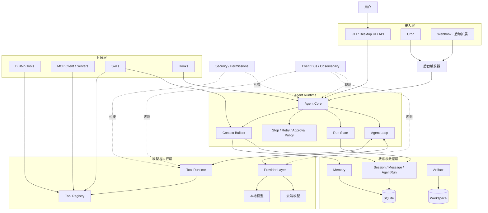
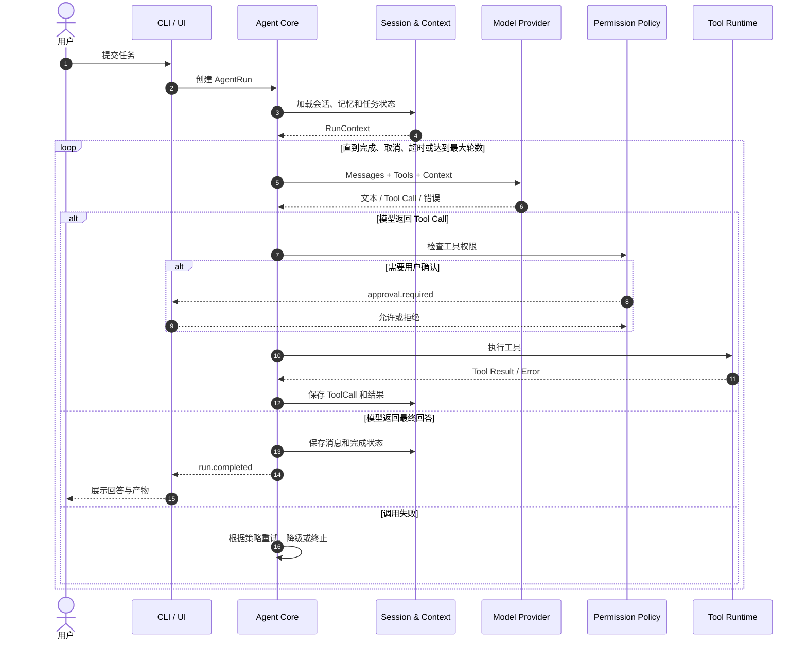

# 个人本地智能助手 Agent 项目设计方案

> 文档定位：用于指导 AI 行业求职者完成一个具备完整工程闭环、可演示、可扩展的 Agent 项目。
>
> 项目重点：不是堆叠功能，而是实现一个边界清晰、运行可靠、过程可观测的本地 Agent Runtime。

## 1. 项目定位

### 1.1 项目名称

Local Agent Runtime（个人本地智能助手框架）

### 1.2 项目目标

构建一个以个人电脑为主要运行环境的智能助手。用户可以通过 CLI 或桌面界面与其对话，Agent 能根据任务自主调用本地或外部工具，管理连续会话，并通过 MCP、Skill 和 Cron 持续扩展能力。

项目完成后，应能够展示以下核心能力：

- 实现完整的 Agent Loop，而非单轮聊天封装；
- 通过统一 Tool Runtime 让模型安全地操作外部环境；
- 通过 Provider 层适配不同云端或本地模型；
- 管理会话、上下文、运行状态和长期记忆；
- 通过 MCP、Skill、Cron 扩展 Agent 的能力和触发方式；
- 对模型调用、工具执行、异常和成本进行观测；
- 对本地文件、Shell 等高风险能力设置权限边界。

### 1.3 推荐演示场景

以“本地工作空间助手”作为贯穿项目的主场景：

1. 用户要求 Agent 分析一个本地项目；
2. Agent 查看目录和文件，必要时执行命令；
3. Agent 在多轮 Tool Call 后生成报告或修改建议；
4. 会话及执行过程被完整保存；
5. 用户下次启动时可以恢复任务；
6. Skill 为 Agent 增加特定工作流；
7. MCP 为 Agent 接入第三方工具；
8. Cron 定期触发项目检查并向用户输出结果。


## 2. 设计原则


### 2.1 核心与扩展分离

Agent Core 只负责推理循环和状态流转，不直接依赖某个模型、工具或 UI。Provider、Tool、MCP、Skill 和 Trigger 均通过接口接入。

### 2.2 一切执行均可追踪

模型请求、工具调用、用户确认、错误恢复和最终结果都应形成结构化事件，以便日志记录、调试和 UI 展示。

### 2.3 本地能力默认受限

读取、写入、Shell、网络访问和删除操作应有不同权限等级。高风险操作必须在执行前向用户展示目标和参数。

### 2.4 先建立可靠闭环，再增加智能程度

项目先完成可运行、可恢复、可调试的单 Agent，再考虑复杂规划、多 Agent、自我反思和向量记忆。

### 2.5 扩展使用统一内部模型

不论工具来自框架内置、用户代码还是 MCP Server，进入 Agent Core 前都转换成统一 Tool 定义；不论任务来自 CLI、Cron 还是未来的 Webhook，都转换成统一 Agent Run。

## 3. 总体架构

```text
┌──────────────────────────────────────────────┐
│                Interaction Layer             │
│             CLI / Desktop UI / API           │
└──────────────────────┬───────────────────────┘
                       │ User Input / Events
┌──────────────────────▼───────────────────────┐
│              Session & Context Layer         │
│ Session / Message / Context / Memory         │
└──────────────────────┬───────────────────────┘
                       │ Run Context
┌──────────────────────▼───────────────────────┐
│                   Agent Core                 │
│ Agent Loop / State / Tool Routing / Policies │
└───────────────┬─────────────────┬────────────┘
                │                 │
┌───────────────▼────────┐  ┌─────▼──────────────┐
│     Provider Layer     │  │    Tool Runtime    │
│ LLM / Model Capability │  │ Registry / Execute │
└────────────────────────┘  └─────┬──────────────┘
                                  │
┌─────────────────────────────────▼────────────┐
│                 Extension Layer              │
│ Built-in Tools / MCP / Skills / Cron / Hooks │
└──────────────────────────────────────────────┘

横向基础设施：
Configuration / Storage / Security / Observability / Event Bus
```


### 3.1 总体分层架构图




架构依赖方向保持为：接入层调用 Agent Runtime，Agent Runtime 通过抽象接口使用模型和工具，扩展能力通过适配器注册到内部系统。Session、Security 和 Observability 为整个运行过程提供状态、安全与可观测性支持。

## 4. 核心对象


| 对象         | 主要职责                                 |
| ---------- | ------------------------------------ |
| Agent      | 描述一个 Agent 使用的模型、提示词、工具和策略           |
| Session    | 保存一段连续交互及其元数据                        |
| Message    | 表示用户、模型、系统或工具产生的消息                   |
| AgentRun   | 表示一次可执行、可暂停、可恢复的任务运行                 |
| RunContext | 汇总当前执行所需的会话、配置、权限和运行状态               |
| Provider   | 屏蔽不同模型服务和协议的差异                       |
| Tool       | 描述 Agent 可以执行的一项原子操作                 |
| ToolCall   | 表示模型发起的一次工具调用及执行结果                   |
| Skill      | 描述完成某类任务的方法、约束及能力依赖                  |
| Trigger    | 通过 CLI、Cron 或 Webhook 等方式创建 AgentRun |
| Artifact   | 表示 Agent 生成的文件、报告或其他产物               |
| Event      | 描述运行过程中发生的状态变化                       |


## 5. 核心模块设计


### 5.1 Interaction Layer

负责接收用户输入和呈现运行过程。第一版建议只实现 CLI，待核心稳定后再增加桌面界面。

主要职责：

- 创建、选择和恢复会话；
- 接收自然语言任务；
- 展示模型流式输出；
- 展示 Tool Call、运行进度和异常；
- 处理用户确认、取消和中断；
- 展示 Agent 最终生成的 Artifact。

交互层只消费 Agent 事件，不直接编排 Agent Loop。

### 5.2 Agent Core

Agent Core 是系统的运行中枢，负责驱动一次 AgentRun 从开始到结束。

#### 标准 Agent Loop

```text
接收任务
  ↓
创建或恢复 AgentRun
  ↓
加载 Session、Memory、Skill 和可用 Tools
  ↓
Context Builder 组装模型输入
  ↓
调用 Model Provider
  ↓
解析模型结果
  ├─ Final Response ─────────────→ 保存并结束
  ├─ Tool Call ─→ 权限检查 ─→ 执行 ─→ 写回结果 ─┐
  ├─ Approval Required ──────────→ 等待用户 ─────┤
  └─ Error ───────→ 重试、降级或终止 ────────────┘
                         ↑                        │
                         └────────────────────────┘
```

核心能力包括：

- 模型调用与 Tool Call 循环；
- AgentRun 状态机；
- 最大循环次数、超时和取消；
- 工具路由和执行结果回填；
- 用户确认流程；
- 模型或工具失败后的重试与恢复；
- 完成条件和停止条件判断；
- 运行事件发布。

第一版采用直接 Tool Calling 的 ReAct 风格即可，不需要先实现独立 Planner。

#### Agent Loop 时序图




### 5.3 Provider Layer

Provider 层将不同模型服务转换成 Agent Core 可理解的统一协议。

统一接口至少覆盖：

```text
ModelProvider
├── chat(request)
├── stream(request)
├── listModels()
└── getCapabilities(model)
```

主要职责：

- 消息格式转换；
- Tool Calling Schema 转换；
- 流式输出适配；
- Usage 和成本信息标准化；
- 错误、限流、超时和重试标准化；
- 模型能力声明；
- API Key、Base URL 和模型参数管理。

建议先支持一个云端 Provider，再加入一个 OpenAI-compatible 或本地模型 Provider。Agent 应依赖能力声明，而不是直接判断模型名称。

### 5.4 Tool Runtime

Tool 是 Agent 与外部环境交互的最小执行单元。

```text
Tool
├── name
├── description
├── inputSchema
├── permissionLevel
└── execute(context, input)
```

工具来源包括：

- Built-in Tool：文件读取、目录查看、Shell 等；
- MCP Tool：由外部 MCP Server 动态提供；
- User Tool：用户代码注册的自定义工具；
- Skill Dependency：某个 Skill 声明需要使用的工具。

Tool Runtime 负责：

- 工具注册、发现和去重；
- 输入参数校验；
- 权限判断与用户确认；
- 执行、取消和超时；
- 结果长度控制；
- 错误标准化；
- Tool Call 日志和 Trace。


### 5.5 Session、Context 与 Memory

Session 不只是聊天记录，还承载一次长期任务的运行历史。

```text
Session
├── metadata
├── messages
├── runs
├── toolCalls
├── artifacts
└── summary
```

Context Builder 负责将下列信息组装成模型请求：

```text
System Prompt
+ Agent 配置
+ Skill 指令
+ 会话摘要
+ 长期记忆
+ 最近消息
+ 当前 Run 状态
+ 可用 Tool 描述
= Model Request
```

Memory 建议分阶段实现：

- Short-term Memory：当前上下文窗口；
- Session Memory：当前会话摘要和任务状态；
- Long-term Memory：跨会话的用户偏好和稳定事实；
- Workspace Memory：某个本地项目的约定与背景。

第一版使用 SQLite 保存结构化数据，Artifact 存放在独立 workspace 目录。向量检索不是首期必需能力。

### 5.6 MCP 扩展

MCP 作为 Tool Runtime 的外部适配器，不直接侵入 Agent Core。

```text
MCP Server
  ↓ 能力发现
MCP Client
  ↓ Schema 转换
Internal Tool / Resource
  ↓ 注册
Tool Registry
```

主要设计点：

- MCP Server 配置及启停；
- stdio、HTTP 等连接方式；
- Tools、Resources、Prompts 能力发现；
- MCP Schema 到内部对象的转换；
- 断线、超时和进程退出处理；
- Server 信任等级和工具权限；
- Server 日志与错误观测。


### 5.7 Skill 扩展

Skill 是完成一类任务的可复用方法包，不等同于 Tool。

```text
skill-name/
├── SKILL.md          # 任务方法、步骤、约束和使用说明
├── manifest.json     # 名称、版本、触发方式和依赖
├── tools/            # 可选专用工具
├── prompts/          # 可选提示词
├── scripts/          # 可选执行脚本
└── references/       # 可选领域资料
```

Skill 系统负责：

- Skill 的安装、发现和加载；
- 判断何时启用 Skill；
- 将 Skill 指令注入当前 Context；
- 检查 Skill 所需工具和运行环境；
- 控制 Skill 可使用的权限；
- 支持版本和依赖声明。

三者的边界为：Tool 是原子动作，Skill 是完成一类任务的方法，Agent 是执行目标和策略的运行主体。

### 5.8 Cron 与后台任务

Cron 是 Trigger，不应拥有一套独立的 Agent 执行逻辑。

```text
Cron Trigger
  ↓
创建 Task / AgentRun
  ↓
创建或恢复 Session
  ↓
进入标准 Agent Loop
  ↓
保存结果与 Artifact
  ↓
通知用户
```

主要能力：

- 一次性和周期性任务；
- Cron 表达式；
- 任务启停；
- 并发控制；
- 超时和失败重试；
- 运行历史；
- 结果通知。

未来增加 Webhook 时，也应复用同一 Trigger → AgentRun 机制。

### 5.9 Security

本地 Agent 可以操作真实文件和进程，因此安全设计属于主流程而不是附加功能。

建议划分权限等级：


| 等级  | 示例                     | 默认策略   |
| --- | ---------------------- | ------ |
| 低风险 | 查看目录、读取允许目录内文件         | 可自动执行  |
| 中风险 | 写入文件、安装依赖、访问网络         | 根据策略确认 |
| 高风险 | 删除文件、执行危险 Shell、发送外部消息 | 必须确认   |


还应包含：

- Workspace 访问边界；
- 命令参数展示；
- Secret 与模型上下文隔离；
- Tool 来源和信任状态展示；
- 敏感输出脱敏；
- 运行取消及超时保护。


### 5.10 Observability

系统通过统一事件记录 Agent 的行为：

```text
run.started
context.built
model.started
model.delta
model.completed
tool.requested
approval.required
tool.started
tool.completed
run.completed
run.failed
```

需要观测的指标包括：

- 每次 AgentRun 的完整 Trace；
- 模型和工具耗时；
- Token Usage 和费用；
- 工具成功率和失败原因；
- Agent Loop 轮数；
- 上下文构成及裁剪情况；
- 用户取消和权限拒绝。


## 6. 推荐工程结构

```text
local-agent/
├── apps/
│   ├── cli/
│   └── desktop/               # 后期增加
├── src/
│   ├── agent/                 # Agent Loop、状态和策略
│   ├── providers/             # 模型 Provider
│   ├── tools/                 # Tool 接口及内置工具
│   ├── sessions/              # Session、Message、Context
│   ├── memory/                # 各类 Memory
│   ├── storage/               # SQLite 和 Artifact 存储
│   ├── mcp/                   # MCP Client 与适配器
│   ├── skills/                # Skill Loader
│   ├── scheduler/             # Cron 和 Trigger
│   ├── security/              # 权限与审批
│   ├── events/                # Event Bus
│   └── observability/         # Logging、Trace、Metrics
├── skills/                    # 已安装 Skill
├── config/                    # 本地配置
├── workspace/                 # Agent 工作区及产物
├── tests/
└── docs/
```

对于单人求职项目，可以先保持单仓库和单进程，仅通过目录与接口维持模块边界，不必过早拆分微服务或多个发布包。

## 7. 落地节奏


### 7.1 实施路线图

```mermaid
flowchart LR
    P0[Phase 0<br/>工程骨架] --> P1[Phase 1<br/>最小 Agent Loop]
    P1 --> M1{{M1<br/>Agent 能工作}}
    M1 --> P2[Phase 2<br/>会话与持久化]
    P2 --> P3[Phase 3<br/>Tool Runtime 与安全]
    P3 --> M2{{M2<br/>Agent 能持续工作}}
    M2 --> P4[Phase 4<br/>Provider 抽象]
    P4 --> P5[Phase 5<br/>MCP 与 Skill]
    P5 --> M3{{M3<br/>框架可替换、可扩展}}
    M3 --> P6[Phase 6<br/>Cron 与后台运行]
    P6 --> M4{{M4<br/>Agent 能主动工作}}
    M4 --> P7[Phase 7<br/>Memory、可观测性与作品包装]
    P7 --> M5{{M5<br/>形成求职作品}}
```




路线图中的每个里程碑都应形成一个可独立演示的版本。后一阶段只在前一阶段的验收场景稳定后开始，避免多个未闭环模块同时推进。

### Phase 0：项目骨架与设计约束

目标：建立可持续迭代的基础工程。

交付：

- 项目目录和核心接口；
- 配置加载和日志；
- 基础测试框架；
- AgentRun 状态定义；
- 一份简短架构决策记录。

完成标准：项目可以启动，模块依赖方向清晰。

### Phase 1：最小 Agent Loop

目标：首先跑通真正的 Agent 闭环。

交付：

- CLI 对话；
- 单一模型 Provider；
- 流式模型输出；
- Tool Calling；
- 目录查看、文件读取等 2～3 个工具；
- 最大轮数、超时和取消；
- 基本运行日志。

完成标准：用户提出任务后，Agent 可以连续调用一个或多个工具并给出最终答案。

### Phase 2：会话与持久化

目标：让 Agent 从一次性 Demo 变成可持续使用的应用。

交付：

- SQLite 存储；
- Session 创建、切换和恢复；
- Message、ToolCall 和 AgentRun 持久化；
- 简单 Context 裁剪和摘要；
- Artifact 目录管理。

完成标准：程序重启后，可以查看并继续之前的会话。

### Phase 3：Tool Runtime 与安全

目标：把零散工具升级成统一、可控的执行系统。

交付：

- Tool Registry；
- JSON Schema 参数校验；
- 统一执行结果和错误结构；
- 超时、取消和结果截断；
- 权限等级；
- 用户确认流程；
- Workspace 文件访问边界。

完成标准：危险操作必须确认，工具失败后 Agent 可以读取错误并调整下一步行为。

### Phase 4：Provider 抽象

目标：证明框架不依赖单一模型服务。

交付：

- 统一 ModelProvider 接口；
- 第二个云端或本地 Provider；
- 模型能力声明；
- 错误、Usage 和流式事件标准化；
- Provider 配置切换；
- 基础重试或降级策略。

完成标准：无需修改 Agent Core 即可切换模型 Provider。

### Phase 5：MCP 与 Skill

目标：建立可插拔能力扩展机制。

交付：

- MCP Client 和 Server 配置；
- MCP Tool 动态发现与注册；
- Skill Loader；
- Skill manifest 和依赖检查；
- 一个完整示例 Skill；
- Skill 和 MCP 权限展示。

完成标准：只需安装 Skill 或配置 MCP Server，即可为 Agent 增加新能力。

### Phase 6：Cron 与后台运行

目标：让 Agent 从被动响应转为按计划主动执行。

交付：

- Scheduler；
- 一次性及周期任务；
- Cron Trigger 创建 AgentRun；
- 并发控制和失败重试；
- 运行历史；
- 结果通知。

完成标准：Agent 能定期扫描工作空间并自动生成检查报告。

### Phase 7：Memory、可观测性与作品包装

目标：补齐高级能力，并形成适合面试展示的完整作品。

交付：

- Session 摘要完善；
- 可查看、编辑和删除的长期记忆；
- Agent Trace 查看能力；
- Token、成本和耗时统计；
- 端到端测试；
- 架构图和设计文档；
- Demo 数据、演示脚本和视频。

完成标准：面试官能够看到 Agent 为什么调用某个工具、执行了哪些步骤、失败后如何恢复，以及整个框架如何扩展。

## 8. 项目里程碑


| 里程碑            | 对应阶段      | 可展示成果                |
| -------------- | --------- | -------------------- |
| M1：Agent 能工作   | Phase 0～1 | Agent 自主调用本地工具完成任务   |
| M2：Agent 能持续工作 | Phase 2～3 | 会话恢复、权限确认、错误恢复       |
| M3：框架可替换、可扩展   | Phase 4～5 | 多 Provider、MCP、Skill |
| M4：Agent 能主动工作 | Phase 6   | Cron 自动任务和运行历史       |
| M5：形成求职作品      | Phase 7   | Trace、测试、文档和 Demo    |


## 9. 建议开发优先级

```text
Agent Loop
→ Tool Calling
→ Session
→ Tool Runtime 与权限
→ Provider 抽象
→ MCP
→ Skill
→ Cron
→ Memory
→ UI 与可观测性完善
```

不建议首期投入的内容：

- 多 Agent 协作；
- 复杂 Planner；
- 自动反思和无限自循环；
- 大规模向量知识库；
- 微服务拆分；
- 大而全的桌面 UI；
- 同时支持大量模型和工具协议。

这些功能可以作为后续演进方向，但不应阻塞基础 Agent Runtime 的完成。

## 10. 测试与验收策略

测试重点按照系统风险排序：

1. Agent Loop 是否会正确结束，是否可能无限循环；
2. Tool Call 参数、权限和错误是否正确处理；
3. Session 中断后能否恢复；
4. 不同 Provider 的消息和 Tool Schema 是否保持一致；
5. MCP 断线或工具失败是否影响主进程；
6. Cron 是否重复执行、漏执行或产生并发冲突；
7. Context 裁剪后是否丢失关键任务状态。

建议包含三层测试：

- Unit Test：状态机、Schema、权限、Context Builder；
- Integration Test：真实或模拟 Provider、工具、SQLite、MCP；
- Scenario Test：从用户任务到最终 Artifact 的端到端场景。

