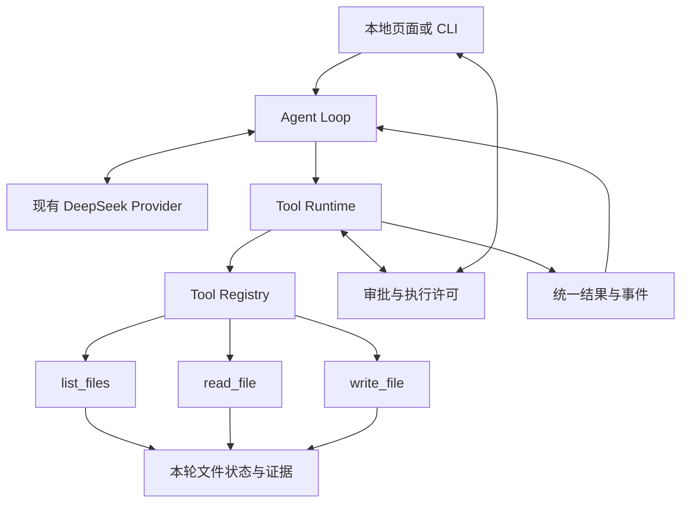

# 工具调用层落地设计与实施方案

## §0 当前进度

- 状态：**阶段 A、B、C 及结果契约复核已实现并通过验证，本批收口。**
- 本批目标：现有只读工具进入同一执行链，用户看得懂动作；新增文件必须经过真实确认，执行结果准确回填模型。
- 当前阻塞：无。会话管理按用户确认列为下一批，不纳入本批完成条件。
- 范围已确认：用户在本次对话明确选择“本批只做工具层，会话管理列为下一批”。因此不实施 Session 持久化或跨重启审批。
- 完成条件：第 10 节必过场景通过，`write_file` 可通过实现和注册接入已完成的通用调用链，用户确认的内容与最终文件一致；随后收口。
- 下一执行项：无。本批按固定停止条件结束；后续从会话管理的新范围另行开始。
- 本地验证（2026-09-10）：结果契约修订后的 `python3 -W error::ResourceWarning -m unittest discover -s tests` **295 项通过，11.457 秒**；独立页面状态脚本与完整浏览器回归通过。新增对抗场景覆盖伪造成功、伪造预览、非法/超大错误、执行证明重放、写入绕过发布、一次审批双发布及 `os.link` 竞态。均使用模拟 Provider，读取与写入使用本机真实文件操作；本轮修订真实 API 调用数为 **0**。
- 证据入口：[工具结果与错误](../../../local-agent/tests/test_tool_runtime.py)、[通用审批/收尾](../../../local-agent/tests/test_tool_workflow.py)、[实际产物闭环](../../../local-agent/tests/test_report_workflow.py)、[取消与等待](../../../local-agent/tests/test_approvals.py)、[文件创建边界](../../../local-agent/tests/test_write_file.py)、[浏览器回归](../../../local-agent/tests/browser_web.cjs)、[确认截图](../../../local-agent/artifacts/tool-approval.png)、[创建结果截图](../../../local-agent/artifacts/tool-created.png)。
- 真实验证（2026-09-10）：使用 `deepseek-v4-flash`（`simulated: false`）完成单文件问答、拒绝报告、确认报告各一次，共 10 次模型请求。三次工具结果均按原调用 ID 进入下一轮；拒绝目标不存在；确认后创建 957 字节报告，SHA-256 为 `031d804a19f42b8a544e956d26b251a9d1016c6ad0743268361567b4a96f472c`，最终回答引用两份源文件。详见[真实模型验证记录](../../../local-agent/trial/tool-layer-live-check.md)。
- 复核结论：本批固定验收 A1–C7 通过；两次独立代码 Gate 最终均为 **PASS**。Loop 只有在内置工具的结果契约及本次执行证明通过后才接纳成功，写入还必须经过一次性发布边界；接纳后的结果按原调用 ID 回填下一轮 Context。该结论只覆盖当前三个内置工具、合成小文件和此前三个真实 run，不宣称统计可靠性或用户收益已测量。会话管理、MCP／用户动态工具及旧专名保真真实复测保持后置。
- 阶段 B 主循环冻结：`local_agent/runtime.py` SHA-256 `dec7592a0296762453a2546d0568baa20e6ee2df2f44c619a1348af24e08280e`。阶段 C 仅通过工具实现、注册与任务策略接入。

## 1. 原文阅读与采用依据

三份原文均已连续、完整读取，包括会议末尾关于“工具与会话一起做”的讨论；不是只检索关键词或读取摘要。

| 来源 | 完整阅读范围 | 对本方案的作用 |
|---|---|---|
| [T：工具调用层设计](../../../1-工具调用层设计.md) | 1–206 行，§0–§11 全部 | 三方视角、声明与执行分离、注册表、五道关卡、错误归属、审批预览、三步改造及停止范围 |
| [M：0910 对齐会议](<../../../meeting/0910/会议录制：agent-meeting 0910-1.md>) | 1–689 行，00:00:02–00:39:09 全部 | 真实调用轨迹、模型填写意图、工具参数与权限边界、Context/Session/Workspace、Provider 与 MCP 的区别、下一阶段顺序 |
| [P：整体项目设计](../../../0-个人本地智能助手-Agent项目设计方案.md) | 1–768 行，§1–§10 全部 | 项目定位、分层架构、核心对象、模块职责、里程碑、工程结构和验收策略 |

取舍顺序：用户本次明确的范围决定 → 最新工具专项设计和会议中的具体约束 → 总体设计的长期方向。会议中的例子、口头备选方案不直接当作已确认接口，也不据此确认任何供应商当前的 API 能力。

### 1.1 来源之间需要统一的地方

| 议题 | 原文差异或需要澄清之处 | 本批采用的设计 |
|---|---|---|
| 阶段顺序 | P §7 将 Session 放在 Tool Runtime 前；M 00:38:37–00:39:09 讨论两者一起做；T §10 明确不提前持久化 | 按用户本次答复，先完成工具层；会话列下一批，不作为审批的依赖 |
| 用户看到的说明 | T §2 是根据参数生成的动作说明；M 00:16:43–00:22:45 强调模型填写调用意图 | 同时保留 `intent`（模型说明目的）和 `action_summary`（程序说明实际后果）；审批依据后者及真实参数 |
| 中风险谁放行 | T §6 默认确认；M 00:23:02、00:35:17 举过模型判断或默认放行的备选 | 本批新建文件默认逐次确认；放行权在程序和用户，模型不能给自己授权 |
| 风险判据 | T §6 强调能否撤销；P §5.9 同时要求权限、外部影响和 Secret 隔离 | 可逆性用于理解后果，还要考虑授权范围和对外发送。只读不等于可以读取任意文件 |
| 第三步主循环不改 | T 第二步只写了错误归属和文案，第三步却要求审批自动出现 | 在阶段 B 补齐通用审批、结果处理与任务完成接口；阶段 C 才用真实写入验证这些接口 |
| “工具自己记账” | T §3 的说法容易被实现成每个工具独立维护授权，或后台线程直接记账 | 文件工具共享每次 run 独立的文件状态；只读结果由运行线程接纳后更新授权和证据；写入回执在运行控制器的发布锁内与实际发布一同记账 |
| 测试完全不改 | T §9 要求第一步现有测试原样通过 | 适用于阶段 A；阶段 B 改变消息协议时可更新相关断言和替身，原有权限与上下文保障不能删除 |
| “只写声明接上” | T §8 同时要求工具拥有执行方法 | 准确含义是“实现工具 + 注册声明”，不修改主循环路由；声明本身不能完成文件写入 |

## 2. 本阶段产品目标与范围

**用户要求读取一两份小文本并生成一份报告；Agent 展示读取动作，提出具体的新建文件方案，用户确认或拒绝后，模型收到真实执行结果并结束任务。**

本批完成三个内置工具：`list_files`、`read_file`、仅新建的 `write_file`。前两个迁移，第三个用于证明扩展和审批可用。沿用当前 Python 标准库、单进程、DeepSeek Provider、本地网页和 CLI。

| 本批交付 | 边界 |
|---|---|
| 工具声明与 Registry | 静态注册三个内置工具；拒绝重名；仅暴露当前任务可用的工具 |
| 通用调用链 | 查找、参数验证、权限判断、审批、限时执行、接纳结果、记录与回填 |
| 可见过程 | 模型意图、程序动作、来源、风险、执行状态；沿用现有事件列表和轮询 |
| 新建报告 | 用户指定输出相对路径；一轮最多成功新建一份 UTF-8 `.md` / `.txt`，上限 32 KiB |
| 审批 | 仅本次 run、当前进程有效；确认、拒绝、过期、取消均有明确结果 |
| 可核查产物 | 文件实际创建后由程序产生回执，最终结果与页面据回执展示产物 |

本批不交付：覆盖或编辑已有文件、删除、自动建目录、Shell、网络工具、MCP、用户动态注册、Skill、更多 Provider、SQLite、跨 run 授权、跨重启续跑、流式正文或通用事实验证器。

新文件写入采用最小方案：**只新建，不覆盖**。现有文件冲突时报告冲突；不会通过改后缀、删旧文件或自动改名绕过用户指定的目标。

### 2.1 方案选择

| 方案 | 收益 | 代价与取舍 |
|---|---|---|
| **A：三工具 + 单次新建审批，推荐** | 能验证扩展、可见动作、授权和真实副作用回填 | 本批不支持编辑旧文件，演示范围清晰 |
| B：仅重构两个只读工具 | 变更最少 | 无法证明审批和有副作用工具能接入，不满足 T §8–§11 的终点 |
| C：工具层、文件编辑与会话持久化一起做 | 功能更完整 | 同时引入恢复、覆盖、授权寿命等多个问题；用户已明确将会话后置 |

## 3. 与当前实现如何衔接

已核对现有实现；下列判断来自代码，而非仅重复原稿。

| 当前代码 | 事实 | 本批动作 |
|---|---|---|
| [runtime.py](../../../local-agent/local_agent/runtime.py)，148–153、230–259 行 | 具体类型判断、工具名判断、读取证据和 scope 处理进入主循环 | 移入文件适配与通用执行层，主循环只处理调用及通用结果 |
| [discovery.py](../../../local-agent/local_agent/discovery.py)，31–130 行 | `DirectoryTools` 已保存发现、已读、累计预算和范围；`record` 已与 `execute` 分离 | 复用这套状态和规则，不另建重复授权账本 |
| [files.py](../../../local-agent/local_agent/files.py) | 已有逐级打开目录、根身份校验、普通文件检查、大小限制 | 保留；写入复用同一工作区边界。阶段 B 再区分系统权限错误与模型越界 |
| [runtime.py](../../../local-agent/local_agent/runtime.py)，115–129 行 | 读取正文会在模型视图转换为行号映射，原证据不变 | 转移到文件消息适配器，统一信封迁移时仍保留这个能力和输入上限 |
| [answers.py](../../../local-agent/local_agent/answers.py) | 只读问答的完成规则；不能证明文件已创建 | 保留引用检查，增加任务完成策略及程序产物回执 |
| [web_runs.py](../../../local-agent/local_agent/web_runs.py) / [app.js](../../../local-agent/local_agent/static/app.js) | 已有工具事件、进度和路径展示，但文案依赖具体工具名；尚无审批状态 | 补通用说明及审批卡片，复用页面，不建设新的轨迹面板 |
| [runtime.py](../../../local-agent/local_agent/runtime.py)，61–93 行 | 超时后停止等待 daemon 线程，无法强制撤销已经执行的系统操作 | 不能直接用这种方式包裹最终写入；写入需要准备与发布分离 |

因此，“完全加不了第三个工具”“没有任何工具调用记录”“所有错误都会回模型”均不是精确现状。真实问题是扩展需要侵入主循环、部分文件错误被合并、缺少通用审批；配置及 Provider 错误已经有直接停止路径。

## 4. 职责与接口



| 单元 | 负责 | 不负责 |
|---|---|---|
| Tool | 声明能力、验证特定参数、生成真实动作说明、执行动作、接纳自己的结果 | 决定用户是否已授权、调用模型、直接推进主循环 |
| Registry | 注册去重、导出 schema、按名字查找、汇总各状态提供者的摘要 | 执行工具、等待用户、持久化会话 |
| Tool Runtime | 五道关卡、结果标准化、审批衔接、工具预算及执行结果接纳 | 模型选工具、选择新任务目标 |
| 文件状态 | 已发现路径、读取快照、原累计预算和本轮产物；被关联工具共享 | 全局会话、跨 run 记忆 |
| Agent Loop | 问模型、转交调用、回填结果、根据通用结果继续或停止 | 根据 `read_file` / `write_file` 分支执行 |
| 任务完成策略 | 用户输入格式、提示词、证据校验、必需产物是否生成 | 自行写文件、伪造工具成功 |

模型调用次数、整轮活动时间、每次模型回复的工具调用上限仍是 run 级预算；读取文件数量等是工具域预算。不能全部迁入某一个工具，也不能为每个文件适配器复制一份。

### 4.1 最小工具契约

实际接口集中在 `tool_runtime.py` 与文件适配器；本批 schema 只支持扁平字符串参数，不实现插件框架或任意 JSON Schema 引擎。

```text
ToolSpec
  name, description, input_schema
  risk: low | medium | high
  source: builtin | user | mcp       # 本批注册值只有 builtin
  timeout_seconds, max_result_bytes
  error_codes, user_error_codes

Tool
  spec
  validate(arguments)              # 可选；返回 None 或标准错误，不产生副作用
  preview(arguments)               # 程序生成 action_summary 和后果预览
  verify_preview(arguments, preview) # 按冻结参数独立核对用户看到的后果
  execute(arguments)               # 读取结果或纯内存写入候选
  verify_success(arguments, data)  # 核对成功结构与本次真实执行／发布证明
  commit(arguments, candidate, check=..., publish=...) # 写工具准备临时内容，通过 publish 发布

FilePolicy
  initial_messages(...), model_request(...), accept(...), validate(...), result_fields()

ToolRegistry
  register(tool), schemas(), get(name), summary()

ToolRuntime
  invoke(call, run_control)         # 返回结果信封及 continue/finalize_only/stop 决定
```

执行上下文由程序通过 RunControl、ApprovalBroker、`check`/`publish` 回调传递：run ID、调用 ID、工作区边界、取消和截止时间、审批冻结的执行许可。模型参数不能设置来源、风险等级、权限根目录或放宽超时。

保留旧 `Runtime(provider, tool, trace, config)` 构造入口作为迁移兼容门面；类型识别和旧工具转换集中到 `file_tools.py` 的适配入口，随后只给循环传统一工具运行时与任务策略。不得将旧 `isinstance` 路由换成另一套散落在循环中的工具名分支。新入口直接构建 Registry；旧只读入口无需用户改命令。

### 4.2 模型说明与用户说明

阶段 A 保持旧 schema。阶段 B 统一为每个工具参数加入必填 `intent`，1–200 字符，表示本次调用目的；业务参数仍保持扁平：

```json
{"intent":"核对项目的评审人","path":"review.md"}
```

```json
{"intent":"保存本次资料的结论","path":"summary.md","content":"# 项目结论\n……\n"}
```

工具层剥离公共 `intent` 后将业务参数交给原执行器，避免旧 `_valid_arguments` 把它当成非法字段。检查必填、类型、额外字段、长度及重复 JSON 键；schema 和运行时校验由同一参数定义产生，不让二者分别漂移。

用户同时看到：“模型意图：保存本次资料的结论”“实际操作：新建 summary.md，预计 1.2 KiB，来源：内置，需要确认”。后一句由程序按合法路径和实际 UTF-8 字节数生成。`intent` 仅作说明，不作为完成证明、权限凭证或隐含推理记录。

### 4.3 状态与文件证据

每次 run 新建工具实例及文件状态。`list_files`、`read_file` 的适配器共享原 `DirectoryTools` 的授权和覆盖范围；只读快照从主循环迁入同一文件域。Registry 对共享状态仅汇总一次。

读取执行线程只产生候选结果；底层文件工具同时留下与本次参数和完整返回值绑定的一次性执行证明。适配器必须校验结构并消费该证明，单独声称 `ok=true`、重放旧证明或替换正文／摘要均不能更新证据。Tool Runtime 检查 run 仍有效后调用 `accept`，再生成 scope 并回填。迟到的读取或目录结果不得更新授权、快照和完成状态。失败重读撤销旧证据，但不释放已消耗的累计文件预算。

新建产物单独记入 `artifacts`，不作为已读原始证据。指定的输出目标从本次输入发现范围排除，生成后也不自动加入读取快照、补齐未读文件或充当自己的引用来源。下一次新任务是否读取它，由下一次任务的输入范围决定。

## 5. 统一结果与错误决策

阶段 A 内部适配、外部保持旧格式；阶段 B 将模型工具消息统一为下列格式，相关测试和评测解析器同步更新。无需永久同时维护两套线上消息协议。

```json
{"ok":true,"data":{"path":"review.md","content":"评审人：林舟\n","line_count":1},"scope":{"read_files":["review.md"]}}
```

```json
{"ok":false,"error":{"code":"FILE_NOT_FOUND","message":"没有找到这份文件，可检查已发现的路径。","owner":"model"},"scope":{"read_files":[]}}
```

上面 `data` 和 `scope` 只展示相关字段，实际读取保留现有字节数、摘要及完整范围字段。`scope` 是顶层运行摘要，成功和失败都带；产物与输入范围分别汇总。

Runtime 不把 Adapter 的 `ok=true` 当作完成证明。Registry 只接纳声明错误码并实现结果验证器的工具；成功数据先按具体工具契约核对，失败码必须属于该工具的白名单，格式损坏、未知错误码、不可序列化或超限结果会转成带原调用 ID 的结构化错误。Adapter 提供的 `owner` 不具权威性，由 Runtime 重新计算。

`owner` 表示谁有能力采取下一步行动，不表示谁犯错。它由程序根据错误类别与任务约束确定，模型不能填写。`owner=user` 的错误先保存实际结果，随即停止本 run 并给出明确说明，不额外调用模型来解释环境故障。

| 情况 | owner / 运行决定 | 行为 |
|---|---|---|
| 工具名不存在、参数缺失/类型错/额外字段、intent 非法 | model / continue | 同原调用 ID 回填，模型在既有预算内自行更正 |
| 文件缺失、不支持的格式、未发现路径、模型请求越界、读取文件数超限 | model / continue | 回填明确边界，允许换合法动作或合理结束，不扩大权限 |
| 操作系统 EACCES/EPERM、工作区根身份改变、磁盘满、真实 I/O 故障 | user / stop | 报告实际原因和用户可采取的动作；不以“模型多试几次”解决 |
| 用户指定输出目标已存在或没有父目录 | user / stop | 不覆盖、不自动建目录、不另选输出路径 |
| 用户拒绝本次写入 | model / finalize_only，一次收尾机会 | 回填 `USER_REJECTED`，封闭该 run 的输出许可，之后只能收尾，不反复弹相同审批 |
| 审批过期、无可用审批通道 | user / stop | `APPROVAL_EXPIRED` / `APPROVAL_UNAVAILABLE`，不执行写入 |
| 工具超时、整轮超时、取消 | stop | 记录明确终态；保留本批原有停止语义，不把全局停止误当成模型可重试错误 |
| 未预期程序异常 | user / stop | `IO_ERROR`，提示本地工具异常；不泄露堆栈或让用户猜测缺哪个参数 |

缺密钥、Provider 认证及 Trace 错误保持当前所属层的检查，不伪造为某次文件工具的错误。阶段 B 在文件层拆开目前混在 `PATH_DENIED` 中的“模型越界”和“系统无权限”，不能只加 `owner` 字段而保留原来无法区分的错误映射。

消息关联保持：先保存 assistant 的原始 ToolCall，再为每个合法调用 ID 追加一次 tool 结果，之后才发起下次模型请求。同一批发生 stop 或 finalize_only 时，其余未执行调用记录 `TOOL_SKIPPED` 及停止原因；不遗漏调用配对，也不继续执行。重复或缺失调用 ID 属于模型协议错误，不能猜一个 ID 修复。

中风险工具的预览、审批、执行和结果验证分别取得冻结参数的独立副本。`write_file` 的成功回执必须匹配批准路径、正文的真实字节数和 SHA-256，并在写入 `artifacts` 前通过 `publish` 验证；一次审批最多消费一次发布尝试。若回执无法确认则返回 `WRITE_OUTCOME_UNKNOWN`，若同名文件在发布瞬间出现则精确返回 `FILE_EXISTS`，均不自动重试或伪造成功。

读取正文的行号视图仍只作用于发给模型的副本；快照和保存的原始结果不改写。结果不能为了缩短而静默删正文后声称“完整读取”：沿用文件与请求大小限制，超出则结构化失败；本批不做分页或上下文压缩。写入结果只返回回执，不再次回传整份报告正文。

## 6. 审批、等待与停止

### 6.1 本批策略

- 允许范围内的 `list_files` / `read_file` 自动执行，仍受路径和预算约束。
- `write_file` 仅在用户填写输出路径的任务中注册。填写路径允许提出写入方案；最终内容仍须预览并确认。
- 本批只展示“确认这次新建”“拒绝”。T §6 的“本会话记住此目录”后置到会话阶段；当前每轮最多一个产物，跨调用授权没有必要。
- 风险等级由工具声明和程序约束确定；来源恒为内置。未来高风险能力默认逐次确认，本批不注册这类能力。

### 6.2 审批记录与界面

内存审批记录包含 `approval_id`、run ID、call ID、工具名、冻结后的规范路径和内容、程序摘要、风险、来源、到期时间及状态。用户确认与这份不可变快照绑定；修改路径或内容必须产生新的待批准动作，不能复用旧批准。

卡片显示目标相对路径、**新建而非覆盖**、内容大小、可查看完整内容的预览，以及确认/拒绝按钮。正文按纯文本呈现，不执行 HTML。页面刷新可从当前 run 快照恢复等待中的卡片；服务重启后失效。

已实施接口：

```text
GET  /api/runs/{run_id}
     原快照增加 pending_approval；仅等待时非空。

POST /api/runs/{run_id}/approvals/{approval_id}
     body: {"decision":"allow"} 或 {"decision":"deny"}
     返回当前 run 快照。
```

复用现有 Host、Origin 和进程令牌校验。审批 ID 与 run/call 绑定；过期、取消、其他 run 的审批不能生效。相同决定重复提交返回已有状态，不重复执行；冲突决定返回 409。请求只提交决定，不接受浏览器提供的新路径、正文或风险等级。

CLI 复用同一审批接口，在交互终端展示完整预览并等待明确输入；非交互终端遇到需要审批的动作直接返回 `APPROVAL_UNAVAILABLE`。不新增默认同意或全局跳过审批开关。

### 6.3 状态与时间

```text
running → waiting_approval → running → 原有完成/失败终态
                           ↘ rejected：回填拒绝后收尾
waiting_approval → cancelled / approval_expired：不执行目标写入
```

当前默认值：沿用 6 次模型调用、每次模型回复最多执行 4 个工具调用、120 秒活动执行时间、45 秒模型等待、5 秒工具执行、64 KiB 输入上限；审批等待另外最多 300 秒，不消耗模型调用次数，不挤占 120 秒活动时间。新增等待预算由程序管理，模型不能放大。

拒绝和批准本身不调用模型。拒绝结果回填后最多允许一次模型收尾；再提出写入或再次索取审批时直接结束，不形成劝说用户循环。等待时取消会立即作废许可，关闭服务也会唤醒等待者；进程退出后不承诺恢复审批。

审查补充：拒绝产生 `finalize_only`，同批剩余调用以原 ID 回填 `TOOL_SKIPPED`，均不执行，然后在原调用预算内最多请求一次最终答案；若该回复仍调用工具则结束。不是将普通 `continue` 当作收尾。

计时验证使用可注入时钟：正常等待超过原 120 秒后批准仍可继续，工具自身 5 秒执行上限从批准后开始；累计审批等待达到 300 秒仍过期。等待暂停活动计时，不冻结取消信号，也不放宽工具和模型的独立上限。

## 7. `write_file` 的最小安全实现

### 7.1 参数和任务入口

```text
write_file(intent: string, path: string, content: string)
```

`path` 必须等于用户本次指定的输出相对路径；仅 `.md` / `.txt`，父目录必须已存在且是授权工作区内的普通目录。延续隐藏路径、绝对路径、`..`、链接和特殊文件限制，不自动创建目录。`content` 为有效 UTF-8 文本，最多 32 KiB；规范化在预览前完成，批准后字节保持不变。

页面保留原问答流程，仅增加可选“输出文件路径”；不填时仍为只读任务。CLI 使用 `run --output-file summary.md`，与原 `--file` / `--discover` 配合使用。输入校验后将输出目标放入任务策略，不让模型推断或扩大可写范围。

### 7.2 执行与取消的边界

1. 审批前只在内存中准备内容及后果说明，不创建目标或临时文件。
2. 确认后重新核对工作区身份、父目录和目标未存在；不能仅依赖审批前的一次存在性检查。
3. 在目标目录内创建本次运行专用临时普通文件，写入冻结内容并检查结果；失败或取消时清理本次临时文件。
4. 最终发布采用**原子且不覆盖已有目标**的机制；可基于已有目录 FD 与 POSIX 临时文件链接后移除临时名实现。不能用“先 exists，再普通 open('w')”，也不能用会覆盖目标的 replace 代替。
5. 临时写入和校验在有界工作线程执行，不持取消锁；最终发布及真实回执接纳通过 Tool Runtime 提供的 `publish(callback)` 在 RunControl 的同一锁内完成。发布许可与取消使用同一个同步边界。取消先被接纳，则禁止发布；发布已发生，则立即保存真实产物回执，随后取消只能停止后续动作。页面如实显示“文件已生成，后续步骤已取消”。
6. 回执包含 `path`、`bytes`、`sha256`、`operation: created`；只有确定发布完成才记入 `artifacts`。哈希用于程序一致性核对，不要求用户检查哈希字符串。

现有 `bounded_call` 的“超时后丢弃线程结果”不能保证副作用被撤销，因此不得让迟到线程直接发布目标文件。准备工作可以限时等待；最终发布必须经过当前 run 的有效许可和同步边界。不要承诺强制撤销已进入操作系统的文件动作；若发布结果无法确认，停止并标为 `WRITE_OUTCOME_UNKNOWN`，不自动重试、不谎称“没有写入”。

本批不实现进程崩溃恢复、事务数据库或通用回滚。已生成文件不因后续模型/日志失败被自动删除；默认日志只记元数据与摘要，临时产物和审批正文不会被默认完整写入 Trace。

### 7.3 回填与最终完成判定

成功回填示意：

```json
{"ok":true,"data":{"path":"summary.md","bytes":123,"sha256":"实际文件摘要","operation":"created"}}
```

写入字节数及摘要必须来自实际结果；这里的数值和摘要文字只是格式示意。

主循环通过注入的任务完成策略校验最终结果：旧只读任务沿用当前引用规则；带输出目标的任务，除了检查原文依据，还必须检查该目标的成功回执。模型说“已保存”而没有回执，不得变成 `completed`。

写入失败或被拒绝时，写任务策略允许在已有读取成功的情况下返回 `unable`；不能继续套用原来“有成功读取就不允许 unable”的只读约束。页面显示动作的实际状态，不依赖解析模型自然语言来决定文件是否生成。

最终 run 结果由程序附加 `artifacts`，不要求模型填写可信产物列表。即使之后最终答案校验失败、模型超时或用户取消，也保留已经成功创建的文件回执。原引用规则继续验证源文件，不把生成的报告当作原始事实证明。

## 8. 文件落点与最小改动

以下路径相对仓库根目录；“新增”文件均已落盘，本表列出本批应用与测试变更。维持现有目录结构，不迁移到整体设计稿中的整套 `src/` 分层。

| 文件 | 动作与职责 |
|---|---|
| `local-agent/local_agent/tool_runtime.py`（新增） | Tool/Spec、Registry、统一结果和调用关卡；同文件组织少量相关类型 |
| `local-agent/local_agent/file_tools.py`（新增） | 旧工具适配、共享文件状态、schema/模型视图、单文件/目录任务装配及兼容入口 |
| `local-agent/local_agent/approvals.py`、`console_approval.py`（新增） | 内存审批、冻结动作、决定去重、等待期限及执行许可 |
| `local-agent/local_agent/write_file.py`（新增） | 仅新建的 WriteFile，临时写入、发布和回执 |
| `local-agent/local_agent/runtime.py` | 阶段 A/B 改为通用调用与任务策略；阶段 C 不修改 |
| `local-agent/local_agent/files.py`、`discovery.py` | 保留文件边界与账本，阶段 B 细分真实系统错误；不另写一套遍历器 |
| `local-agent/local_agent/answers.py`、`prompts.py` | 保留只读引用检查，增加写任务完成规则、意图和审批结果说明 |
| `local-agent/local_agent/web_runs.py`、`web.py`、`__main__.py` | 装配工具、内存等待状态、决定入口、CLI 审批和可选输出路径 |
| `local-agent/local_agent/static/index.html`、`app.js`、`app.css` | 通用事件说明、审批预览和产物状态；只增加必要控件 |
| `local-agent/local_agent/trace.py` | 公共事件关联字段；新增 intent/preview/content 的默认脱敏处理 |
| `local-agent/local_agent/demo.py`、`directory_evaluation.py` | 阶段 B 适配统一消息，不借此扩大旧评测范围 |
| `local-agent/tests/test_tool_runtime.py`、`test_approvals.py`、`test_write_file.py`（新增） | 注册/路由、审批状态和实际文件副作用验证 |
| `local-agent/tests/test_tool_workflow.py`、`test_report_workflow.py`、`test_web_approvals.py`、`test_console_approval.py`、`report_provider.py`、`browser_tools.cjs`（新增） | 模拟 Provider 下的通用控制、真实文件创建与网页/终端审批验证 |
| `local-agent/tests/test_runtime.py`、`test_directory_runtime.py`、`test_discovery.py`、`test_evaluation.py`、`test_directory_evaluation.py`、`web_fixture.py`、`browser_web.cjs` | 保留核心约束，更新协议断言及报告场景；原 test_web.py、test_cli.py 无修改并通过 |
| `local-agent/README.md`、`trial/directory-check.md`、本文 | 使用说明、当前状态和实施证据 |

第三步允许修改新工具、注册装配、写任务策略、测试与入口；禁止为了识别 `write_file` 给 Agent Loop 增加分支。以阶段 B 完成时的 `runtime.py` 为比较基线，不能在其他地方复制一套写文件专用 Loop 来规避验收。

## 9. 三步实施，每步可运行

### 阶段 A：迁移只读工具，不改变行为

- [x] 新建 Tool/Registry/Tool Runtime 及旧工具适配入口，保留 schema、结果格式、错误码、事件含义及旧构造方式。
- [x] 将类型路由、文件快照更新、scope 汇总和模型行号视图移出循环；复用现有 DirectoryTools 状态。
- [x] 保持原权限、读取上限、原调用 ID、失败重读撤销证据、超时后迟到结果不生效。
- [x] 新增最小 Registry 测试：去重、工具清单、按名字调用测试工具。测试工具只在测试内注册，不增加第四个产品工具。
- [x] 定向检查通过后运行完整原回归。迁移前已有约 200 项测试，执行时以实际发现集合为准；原有测试文件和断言在本阶段保持不变。

停止点：原能力通过同一路由运行，旧测试原样通过。此时不加入 intent、不切信封、不做审批页面，不重跑真实固定组。

### 阶段 B：公共协议、可见过程与通用审批

- [x] 导出并校验公共 intent；切换统一信封，同步模型视图、替身、评测解析和事件白名单。
- [x] 区分模型可处理错误、用户需处理错误和 run 级停止；明确同批调用跳过与消息配对。
- [x] 引入内存审批与等待状态、冻结参数、决定去重、取消和独立等待期限。
- [x] 页面/CLI 使用同一审批逻辑。用无实际文件副作用的中风险测试工具验证允许、拒绝和过期。
- [x] 完成通用任务结束接口及产物回执透传，确保循环不会默认把所有任务当作只读问答。
- [x] 更新发生协议变化的测试及最小浏览器回归；验证工具名不再决定页面文案，默认日志仍不包含正文。

停止点：测试工具能通过通用审批链；低风险不打断、拒绝不执行、用户环境错误不再消耗一次模型调用。冻结此时主循环，进入第三步。

### 阶段 C：接入 `write_file`，完成一个真实产物

- [x] 实现仅新建文件的写工具与实际回执；批准前不写入，发布不覆盖。
- [x] 在有输出目标的任务装配中注册它，加入必要的任务提示和完成策略；不修改 `runtime.py`。
- [x] 接入可选输出路径及产物展示，保留原只读默认行为。
- [x] 运行写入、审批竞争和上下文定向检查；再运行一次受影响集成/浏览器检查及最终 Python 回归。
- [x] 完成第 10 节有限真实演示并保存结果；核对磁盘文件、确认预览和模型收到的回执一致。
- [x] 更新阶段状态及应用 README；按本批验收收口，不顺带加入覆盖、会话恢复或更多工具。

## 10. 必过样例与验证预算

以下是本批验收集合，开发前固定。新增问题先说明它破坏哪条，再决定是否阻塞；不以“还有一个边界”无限加项。

| 编号 | 场景 | 必须得到的证据 |
|---|---|---|
| A1 | 单文件和目录旧任务 | 原事实/引用/权限/状态检查保留，结果按原 ID 进入下一轮 |
| A2 | 新注册测试工具 | 仅实现与注册即可调用；不存在的工具返回标准错误，核心不按工具名分支 |
| B1 | 非法参数与模型修正 | 错字段、缺 intent 的结果回填；下一轮看到错误并可给出合法调用 |
| B2 | 系统权限或磁盘故障 | 明确 owner=user，后续模型调用数不增加；与模型越界错误区分 |
| B3 | 用户可见说明 | 模型意图与真实操作分别展示，来源/风险由程序给出，预览中的 HTML 不执行 |
| C1 | 确认新建 | 点击确认前目标不存在；确认后文件内容与冻结预览逐字节一致，真实回执回填 |
| C2 | 拒绝 | 无目标文件，记录拒绝并允许一次收尾，不重新弹窗或换路径偷写 |
| C3 | 已有目标、越界、链接及审批期间目标被创建 | 旧目标字节保持原样；拒绝覆盖/越界，未授权文件没有变化 |
| C4 | 等待时取消/过期、重复及跨 run 决定 | 无写入；重复确认至多执行一次；错误 run 和过期许可不能放行 |
| C5 | 写入准备时取消、已发布后取消 | 取消先接纳则禁止发布；已发布的则保留回执并停止后续动作，不能报告成完全未执行 |
| C6 | 模型提前说完成、写入后最终回答失败 | 无回执不能完成；已有产物不会随回答失败消失，不从生成报告伪造原始引用 |
| C7 | 摘要不泄露正文、输入及结果上限 | 默认 Trace 不保存 intent/预览/正文全文；超限不静默截断并冒充完整 |

在 `/Users/wujingyu/Desktop/AI/projects/dev-agent/local-agent` 执行现有定向命令：

```sh
python3 -m unittest discover -s tests -p 'test_runtime.py'
python3 -m unittest discover -s tests -p 'test_directory_runtime.py'
```

新增工具层的定向测试命令（文件均已实施）：

```sh
python3 -m unittest discover -s tests -p 'test_tool_runtime.py'
python3 -m unittest discover -s tests -p 'test_approvals.py'
python3 -m unittest discover -s tests -p 'test_write_file.py'
```

集成边界运行：

```sh
python3 -W error::ResourceWarning -m unittest discover -s tests
```

浏览器沿用 `tests/browser_web.cjs` 与 `tests/web_fixture.py`，只增补审批、刷新及产物状态相关场景；不重复打磨视口、主题或整套布局。

**真实 API 验证预算：**阶段 A 不调用；阶段 B 以测试替身验证控制流程；阶段 C 首轮仅 3 个真实 run：①单文件问答，②两份小文件生成报告并确认，③相同任务但拒绝写入。每 run 沿用最多 6 次模型请求，因此首轮上限为 18 次请求，批准/拒绝动作不占模型次数。实际 token 和供应商用量只按返回记录，不伪造人民币成本或统计可靠性。

先使用临时工作区和合成材料。若失败，保留结果，只修当前必过项并重跑受影响样例；需要增加真实组时先说明新增信息价值，不默认重跑以前的 12 次目录基准。通过后停止；测试替身验证、真实模型结果、AI 内容复核和用户确认分别记录。

## 11. 后续衔接与不扩大本批的约束

- 下一批会话管理接管 Session/Message/Run/ToolCall 的持久化；本批只为 run 和 call 保留稳定关联，不设计数据库表或恢复协议。
- Context 是每次模型实际收到的消息、工具清单等输入；Session 是可连续管理的会话；Workspace 是文件边界及工作目录，三者不能互相替代。当前 Trace 存在，不代表会话可恢复。
- P 的长期设计允许 Workspace 下组织不同数据区；当前实现将日志放在模型可读根之外，本批保留这一实际隔离。以后即使共用项目容器，日志/凭据仍不能自动成为可读文件。
- Provider 处理模型服务协议；MCP 以后将外部工具转换后注册；Skill 提供工作方法。它们不改变本批主循环，也不因会议举例而现在接入。
- 若后续允许文件修改，再独立设计 diff、备份/撤销、目标版本变化和审批范围；不能把 `write_file` 的“仅新建”悄悄升级为覆盖。
- 本批展示工具意图和动作即满足可观测需求，不建设全量 Context 可视化、费用面板、持久审批账本或新控制框架。
- 不提交或推送本次来源及方案到公开仓库；这是本地设计交付。公开范围沿用项目规则，会议原文仍保留在被忽略的本地目录。

## 12. 来源覆盖与本轮自检

| 来源范围 | 在方案中的落点 |
|---|---|
| T §0–§3：为何改、三方视角、声明与角色 | §2–§4，结合实际代码修正现状判断 |
| T §4–§5：五道关卡、结果与归属 | §4–§5；保留 Provider/Trace 与工具错误的层次区别 |
| T §6–§8：风险、后果预览、三个工具 | §6–§7；本批限于一次新建审批 |
| T §9–§11：分步、临时审批、停止点 | §9–§11；明确阶段 B 必须先补齐通用审批 |
| M 00:00–00:11：Loop、ToolCall、历史结果回填 | §3–§5，继续复用已经验证的循环与调用 ID |
| M 00:11–00:15：Session、Context、Workspace | §0、§11，采用用户最新的会话后置决定 |
| M 00:15–00:24：三方视角、intent、风险、来源 | §4、§6，区别模型解释与程序授权 |
| M 00:24–00:30：MCP、Provider | §11，仅保留边界与扩展入口 |
| M 00:30–00:39：校验、错误、超时、记账、下一步 | §5–§10，明确后续动作与有限验收 |
| P §1–§4：定位、原则、架构、核心对象 | §2–§4，沿用单 Agent 和统一接口 |
| P §5：各模块，特别是 Tool Runtime/Security/Observability | §4–§7、§11，当前能力与后续扩展分开 |
| P §6–§8：工程结构、路线及里程碑 | §8–§9、§11，按现有代码布局和最新阶段顺序适配 |
| P §9–§10：优先级与测试策略 | §10–§11，按当前风险固定验收，不提前展开完整框架 |

本轮自检只核对：三份原文覆盖完整、来源与建议区分、阶段 A/B/C 相互衔接、写入前授权与完成回执闭合、会话没有混入本批、已有文件路径准确。产品实现与验收仍待后续开发，不由本方案代替。
