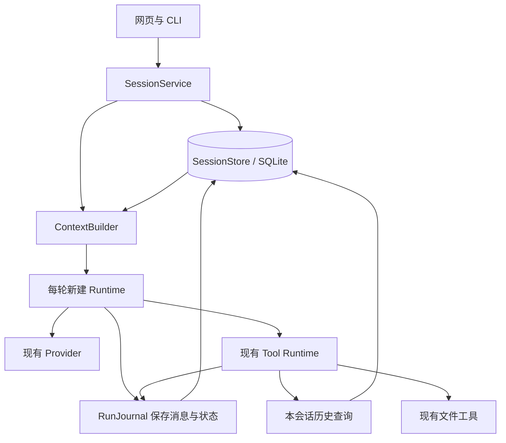

# 会话管理模块设计：长期保存与连续工作

## §0 当前进度

- 状态：**设计已核实并完成实现；2026-09-11 的实现复核已补齐历史搜索续页、按完整返回信封控制分页，以及 S6 的更正／未完事项固定证据。** 当前离线 Gate 为 PASS；真实模型证据边界以[会话验收记录](../../../local-agent/trial/session-live-check.md)为准。
- 本批假设：同一会话能在多次提问、服务重启和历史超过单次输入预算后继续使用，且历史、权限、工具结果不会串到其他会话。
- 实施前缺口是运行状态只在内存中、默认 Trace 无法还原对话；当前 SQLite、受控 Context、摘要和历史回查已经接入。
- 设计完成条件：来源要求、数据归属、保存时机、恢复规则、长上下文策略和必过样例一致，并完成一次独立设计审阅。
- 实现完成条件：§11 固定验收通过。工具层已通过的结论继续有效；离线、浏览器和真实模型证据必须在验收记录中分开陈述。
- 默认采用：SQLite 保存原始历史，最近完整轮次＋可追溯摘要组成 Context，需要时查询本会话原记录；支持文件任务及独立的历史对话追问。
- 本文保留设计约束；[实施计划](../plans/2026-09-10-session-management.md)记录实际落地进度，历史设计措辞不能替代当前验收结论。

## 1. 依据与取舍

本次完整回读总体设计 768 行、0910 会议记录 689 行、工具设计 206 行，并检查已完成工具层的实施方案和实际代码。会议中的口语转写以时间戳定位；举例不等于已确认接口。

| 来源 | 要求 | 本设计的落实 |
|---|---|---|
| [总体设计 §4、§5.5](../../../0-个人本地智能助手-Agent项目设计方案.md) | Session 保存消息、运行、ToolCall、产物和摘要；SQLite；Context 按需构建 | 分开 Session、Run、持久历史、单次模型输入，采用本地 SQLite |
| [总体设计 Phase 2 与 §10](../../../0-个人本地智能助手-Agent项目设计方案.md) | 创建、切换、恢复；简单裁剪和摘要；重启后继续；裁剪不能丢关键任务状态 | 重启恢复、长会话与隔离列为本批必过项 |
| [0910 会议](<../../../meeting/0910/会议录制：agent-meeting 0910-1.md>) 00:05:08、00:09:08–00:10:38 | 模型每次接收历史消息、工具调用及结果 | 保存原始角色、顺序、调用编号；当前 Run 的调用结果完整配对 |
| 同一会议 00:11:28–00:15:30 | 多 Session 隔离；今天关闭、明天还能接上；Workspace 保存工作材料和产物 | 会话 ID 隔离、持久存储、固定工作区绑定；不只做“最近 20 次运行列表” |
| 同一会议 00:36:54–00:37:44 | 模型要感知之前执行了什么、成功失败及卡在哪里，并回看参数以判断如何调整 | 保存调用参数、意图、工具失败、已确认回执和未完成状态；§8.3 提供调用与结果关联的历史回查 |
| [工具设计 §6](../../../1-工具调用层设计.md#6-风险分级按能不能撤销分不按听起来危不危险)、[工具实施计划 §6.1](../plans/2026-09-10-tool-runtime.md#61-本批策略) | 用户可选“本会话记住此目录”；工具阶段约定留到会话阶段 | 按本次修订决定继续后置；首版仍逐次批准新建，原因和范围见下文 |
| [工具设计 §10](../../../1-工具调用层设计.md#10-一个要提前说好的妥协) | 工具阶段先接受审批不跨重启，会话阶段再处理 | 恢复待办和预览；旧执行许可失效，继续时产生新审批 |
| [工具层当前契约](../plans/2026-09-10-tool-runtime.md#41-最小工具契约) | 冻结参数、实际执行验真、一次发布、错误回填、有限预算 | Session 记录这些事实，不从历史反向恢复执行权限 |

两处明确取舍：会议用“存日志文件”解释持久化，本批采用总体设计指定的 SQLite；会议把工作材料、日志都放在广义 Workspace，本实现把私有会话库放在模型可读资料目录之外，避免读取工具绕过会话隔离。

审批范围的补充决定：原工具计划将“本会话记住目录授权”留到本阶段，本次按用户接受的修订建议明确继续后置。当前先验证记录持久和连续对话；目录免重复审批还需要授权范围、撤销和有效期规则，不是本批持续性成立的必要条件。本批不保存可复用的目录写入许可，每个新建动作仍须预览并逐次批准；这既适用于同一进程内的后续 Run，也适用于重启后。审批历史可回看，不等于已实现“记住目录授权”。

## 2. 产品目标与完成边界

代表性任务：今天读取项目资料、讨论报告要求；关闭服务；明天打开同一会话，仍能看到原记录，理解“按上次要求继续”，重新核对变化后的文件，并在新审批后生成报告。连续聊很多轮后，早期要求仍能通过来源记录找回。

“长期有效”分成四项：

1. **记录持久**：已确认保存的输入、回答、调用、错误及产物回执在重启后可读，默认不自动过期或按条数淘汰。
2. **对话连续**：新一轮能利用同一会话的目标、约束和未完成事项；能回溯摘要之外的细节。
3. **执行可信**：历史成功只代表当时成功；旧批准、旧文件快照不能让新一轮跳过权限和证据检查。
4. **增长有界**：存档增长与模型输入大小分开管理；不能靠无限堆叠 Context 或不断加大调用预算延长会话。

本批交付：Session 新建/列表/选择/改名/归档/恢复，连续提问，SQLite 持久化，重启中断处理，摘要及历史查询，网页与 CLI 共用入口，产物记录和本地库备份。

本批不交付：跨设备同步、多用户、Session 合并/分支、跨会话 Memory、向量检索、后台常驻执行、断点处自动续跑、恢复旧批准、本会话目录免重复审批、覆盖文件、自动搬迁产物、流式输出或新 Provider。暂不做永久删除；归档可撤销且不删除历史。

不承诺无限上下文、摘要无损、模型永不遗忘或抵御磁盘损坏。默认不自动过期、原文可找回、异常不伪装成功，是本批可以验证的保证。

### 2.1 三种方案比较

| 方案 | 优点 | 代价 | 结论 |
|---|---|---|---|
| **SQLite 原始记录＋有界 Context＋摘要及原文回查** | 可事务保存、隔离查询、恢复状态；长历史不必全发给模型 | 增加少量持久化与 Context 接入 | **推荐**，覆盖用户强调的持久性和连续性 |
| JSONL 存对话，每次重放全部历史 | 初期实现短 | 截断、查询、重复提交、原子状态更新都要自行处理；长对话仍卡预算 | 不选，现有脱敏 Trace 也不能直接承担此用途 |
| SQLite＋自动恢复执行图＋跨会话长期记忆 | 可恢复更复杂任务 | 要处理跨进程副作用、长期记忆治理和并发调度 | 后置，超出会话第一版目标 |

## 3. 当前实现与必须改变的地方

| 已观察到的事实 | 对会话的影响 | 最小改动 |
|---|---|---|
| [Runtime](../../../local-agent/local_agent/runtime.py) 每次新建，`messages` 仅在 `run()` 中；最终答案直接经 `finish` 返回 | 结束后没有完整的可恢复记录 | 保持一 Run 一 Runtime，注入 Context 和持久记录入口；最终回答也必须先存再返回 |
| [WebRuns](../../../local-agent/local_agent/web_runs.py) 的 `jobs` 只在内存，淘汰 20 条之外的运行；全局只运行一项任务 | 刷新与重启不同；历史列表不能作为 Session | 内存只管在途控制；历史由数据库分页读取，沿用全局单活跃 Run |
| [Trace](../../../local-agent/local_agent/trace.py) 默认将正文、问题和参数变成摘要哈希 | Trace 不足以重建真实对话 | Session 保存必要正文，Trace 继续作为脱敏诊断记录，不从日志反向解析恢复 |
| [FilePolicy](../../../local-agent/local_agent/file_tools.py) 与 [答案校验](../../../local-agent/local_agent/answers.py) 只认可本轮读取 | “我上次的要求是什么”会因未读取失败 | 引入独立会话回答策略；不把历史快照塞进当前文件证据 |
| [ApprovalBroker](../../../local-agent/local_agent/approvals.py) 和执行证明绑定当前 run/进程 | 序列化后不能直接重新使用 | 审批记录可恢复展示，执行许可必须重新生成 |

## 4. 核心对象与模块

| 对象 | 保存内容 | 不承担的职责 |
|---|---|---|
| Session | 标识、标题、工作区绑定、默认资料范围、创建/更新时间、归档状态、摘要版本 | 不代表一个永不结束的 Loop |
| Run / 一轮 | 一次用户提交到最终回答/终止；预算、输入范围、输出目标、父中断运行、执行状态 | 不继承旧 run 的批准、额度或活跃线程 |
| Message | 用户原话、模型回复、工具消息及程序控制记录；来源、角色、稳定顺序 | 不由渲染后的页面文字反向生成 |
| Context | 本次实际发给模型的系统规则、历史投影、当前消息与工具清单 | 不等于数据库全部历史，也不凭空扩大权限 |
| ToolCall / Approval / Artifact | 执行请求、实际结果、当时批准记录、确认过的文件回执 | 不因模型或摘要声称“完成”就新增产物 |



新增三个主要模块：`sessions.py` 负责入口、范围与恢复决策；`session_store.py` 封装 SQLite、事务和记录接口；`context.py` 负责预算、摘要和历史投影。`session_history.py` 实现本会话查询工具。RunJournal 是存储模块提供的窄接口，不再加一套事件总线。

已落地的模块边界：

```text
SessionService: create, list, load, rename, archive, submit, continue_interrupted
SessionStore: begin_run, record_request, record_model_reply,
              record_tool_result, record_approval, record_publication, finish_run,
              load_history, save_summary, recover_interrupted, backup
ContextBuilder: build(session, current_run, budget) -> ModelRequest + ContextManifest
```

网页/CLI 不拼消息，不直接写表。Runtime 不认识 SQLite；它通过 RunJournal 在必要顺序点持久保存。旧一次性 `run`/`demo` 和测试可以使用显式的无持久化记录适配器；进入持久会话后，不允许数据库失败时悄悄降级到内存。

## 5. 存储模型与长期保留

### 5.1 位置和数据范围

- 默认目录为 `~/.local/share/local-agent/`，数据库为 `sessions.sqlite3`；`--state-dir` 仅由启动配置指定，首次打开 Store 时创建。
- 状态目录、数据库侧文件和备份都必须位于模型可读资料根目录之外；不能通过网页参数改位置。目录权限 0700、文件权限 0600；数据库和备份加入 Git 排除范围。
- 保存用户输入、可恢复的模型消息、工具参数/结果、源文件当时的返回正文、批准预览、最终答案和回执。这是会话业务数据，区别于脱敏 Trace；首次启用页面用一句话说明“对话和已读取内容保存在本机”。
- Provider 密钥、请求认证头、进程令牌和 `reasoning_content` 不入库。普通正文仍可能包含用户提供的敏感资料，不宣称自动识别或加密全部敏感文字。
- 默认不设置 TTL、不因超过 20 个 Run 删除历史。页面每页 20 项仅是展示分页。归档只改 Session 状态；恢复后可继续。
- Artifact 文件保留原工作区路径，数据库保存回执；不复制一份当作输入，也不自动搬迁、覆盖或删除用户文件。

### 5.2 第一版表与约束

字段是设计契约，具体迁移 SQL 在实现计划中落实。

| 表 | 核心字段和约束 |
|---|---|
| `sessions` | `id`、`title`、`workspace_path`、根目录设备/inode 身份、`scope_json`、`status(active/archived)`、时间、`revision` |
| `runs` | `id`、`session_id`、`client_request_id`、输入正文/范围引用、`parent_run_id`、`state`、`stop_reason`、预算/用量、开始结束时间、`result_json`、Trace 引用、系统/工具/协议版本快照、每次请求 manifest |
| `messages` | `id`、`session_id`、`run_id`、`session_seq`、`run_seq`、`role`、`source_kind`、`payload_json`、校验状态、时间；会话序号唯一、Run 内序号唯一 |
| `tool_calls` | `run_id + call_id` 唯一、原 assistant 消息引用、名称、阶段、结果消息引用、`publication_intent_json` 和发布核对状态；参数以原消息为准，不保存第二份可漂移正文 |
| `approvals` | `approval_id`、所属 run/call、冻结预览与参数摘要、决定、创建/失效时间、进程代次；历史记录不等于活跃许可 |
| `artifacts` | 所属 run/call、路径、真实字节数/摘要、回执、确认时间；另外记录恢复核对状态；未知结果不放进“已创建”列表 |
| `summaries` | 所属会话、版本、覆盖到的 `session_seq`、结构化摘要与原消息锚点、模型/提示版本、生成状态；只替换活动指针，保留原历史 |

使用外键及事务保证归属；内部引用必须同时匹配 `session_id`，历史查询不接受客户端指定其他会话的 message ID。ToolCall ID 只在 Run 内唯一，不要求不同 Run 的模型永远生成不同 ID。

新增会话从启用后的提交开始记录；旧脱敏 Trace 不具备原文，不自动导入或声称可恢复。原 Trace/验收记录保留原样。当前服务内存中的旧 Run 也不自动伪装为持久 Session。

同一会话的 `(session_id, client_request_id)` 唯一：对规范化后的完整提交（问题、任务类型、资料范围、输出目标、父中断 Run 及用户指定执行选项）计算请求指纹。相同 ID 且指纹一致返回原 Run；任一执行语义不同则返回冲突，不能仅比较问题正文。第一次插入用户消息和 Run 的事务完成后，才能答复“已接收”并启动执行。

沿用单机单服务所有者：状态目录进程锁阻止两个写入者同时管理同一数据库；全局一次只执行一个 Run，但可切换查看其他会话。同服务的重复提交由事务处理。CLI 使用同一库时若网页服务正持锁，返回明确占用提示；首版不增加跨进程执行队列。

### 5.3 持久化原则

- 开启外键、SQLite WAL 与完整同步模式；短事务、5 秒 busy timeout，不在模型/审批等待期间持数据库写事务。
- 每个连接只由所属线程使用；RunJournal 封装串行写入。记录提交成功才推进相应可见状态。
- 库版本通过 `user_version` 管理。迁移前使用 SQLite backup 接口生成一致备份；迁移失败保留原库并停止写入，不能新建空库冒充恢复成功。
- 提供手动 `sessions backup`；备份包括会话库与原文，不包含工作区 Artifact 文件。不得在 WAL 活跃时只复制主数据库文件当作完整备份。自动异地备份不属于本批。
- 磁盘满、损坏、版本不兼容等错误明确报 `SESSION_STORE_ERROR`/`SESSION_SCHEMA_UNSUPPORTED`，停止新副作用；不承诺故障中的最后一次未提交结果已经保存。

## 6. 一轮的保存顺序

| 时刻 | 必须完成的持久操作 | 失败时行为 |
|---|---|---|
| 用户提交 | 原子保存用户消息、Run、请求幂等标识 | 不启动模型，不显示已保存 |
| 发起模型请求前 | 保存请求 manifest、预算计数、输入摘要及规则版本 | 停止；不发起未记录请求 |
| 收到模型回复 | 保存原消息及校验状态；合法 ToolCall 与索引同事务写入 | 不执行这条回复中的工具 |
| 工具执行前 | 保存 `requested/started` 阶段；需审批则先保存待批准预览 | 不执行无法留痕的动作 |
| 用户允许/拒绝 | 决定与 run/call、参数摘要绑定并提交 | 不发放执行许可；旧批准不可回放 |
| 只读执行返回 | 先验真，再原子保存结果消息与 ToolCall 终态，之后接纳本轮证据 | 不把未保存的结果发给下一轮模型 |
| 新建文件发布 | 保存发布意图 → 在现有发布锁内执行一次 callback → 验真并持久保存回执 → 接纳 artifact | 见 §7 的文件/数据库非原子窗口 |
| 最终回答/失败 | 保存模型原回复、校验结论、用户可见答案/产物引用和终态 | 保留已落库事实，展示保存失败；不显示已永久保存的完成结果 |

DB 是会话恢复的权威来源；Trace 仍记录脱敏过程。Trace 出错不能删除已保存的答案/回执。接纳顺序在 Tool Runtime 增加通用 journal 接口完成，不在 Agent Loop 按具体工具名分支。

一次 tool 结果仍关联原调用 ID。当前 Run 中 assistant ToolCall 与对应 tool 消息完整保存、完整投递；不把缺失结果的半段消息链直接发给 Provider。模型协议非法的原回复保留为诊断记录，不进入下一轮的合法协议链。

## 7. 重启、审批与中断恢复

### 7.1 恢复的是会话，不是原线程

服务持有状态库独占锁后才执行启动恢复：上一进程遗留的 `queued/running/waiting_approval` Run 统一标记 `interrupted`，写明中断阶段。已经提交的终态保持原样。旧进程令牌、审批 ID 的执行能力、单调时钟和一次性结果证明全部作废。

打开会话只是查看，不调用模型、不执行工具。用户发出新消息或点击“继续未完成任务”，才创建带 `parent_run_id` 的新 Run；保留原问题、最后进度与明确中断信息，重新计算 Context，重新取得文件证据和审批。新的正常预算只在这次明确提交时生效；启动恢复不能自动循环创建新 Run。

| 中断点 | 重启后的事实与动作 |
|---|---|
| 输入已保存、模型未请求 | 输入可见，原 Run 为 interrupted；用户可继续 |
| 模型请求已发出、回复未保存 | 标记请求结果未知，不猜回答、不自动重发；成本可能已发生 |
| 读取前/中，或结果未保存 | 保留当时进度；新 Run 如需资料重新读取 |
| 等待审批，或允许后且尚无已提交的发布意图 | 展示旧预览及“审批已失效”；新 Run 重新校验并生成新审批，不能点击旧 ID 放行 |
| 已保存真实发布回执、尚未回答 | 展示已创建产物，继续时把它当历史事实；不再次写同一目标 |
| 发布意图已保存、实际文件与回执提交之间崩溃 | 标记 `WRITE_OUTCOME_UNKNOWN`；展示待核对目标，不宣称已创建，也不自动重试 |

未完成调用不伪造为一次真实成功/失败工具返回。启动恢复在 ToolCall 状态上写 `interrupted/unknown` 与恢复事件；新 Context 只接收标明来源的中断说明，不塞入孤立的 `role=tool` 消息。

### 7.2 文件发布与数据库提交之间

SQLite 事务不能与文件系统发布合成一个原子事务。沿用实际文件回读校验、一次性 publish 与取消锁，增加以下记录顺序：

1. 在最终发布之前持久记录 `publication_intent`、原目标、冻结内容摘要、run/call/approval 关联。记录失败则禁止发布。
2. 真正发布并验真后，立即在同一受控区段保存回执和 ToolCall 结果；成功后才显示持久 artifact。
3. 若文件已创建但存库失败，当前进程仍保留实际回执并说明“已创建，保存状态失败”；停止后续动作。重启看到未完成意图时按未知处理，不凭路径相同或摘要相同断言文件由本 Agent 创建。
4. 可用只读核对显示目标目前存在/缺失/不一致，但核对结果不能升级为历史创建证明。用户可保留该文件或显式指定新输出目标；服务不自动删除、覆盖、改名或重写未知目标。

同一工作区内存在未知发布记录的目标，新的会话也不能自动绕过它；按工作区身份＋相对路径查询操作风险，不向其他会话泄露原对话/正文。显式处理前禁止对该目标再次发布。已知 `FILE_EXISTS` 等明确失败仍保留精确错误，不统一降成未知。

## 8. 长会话的 Context 与原文回查

### 8.1 组装顺序与信任级别

```text
当前程序 system 规则与工具 schema
+ 本会话的派生摘要和运行状态（结构化历史数据）
+ 最近完整轮次（保留用户与助手身份；工具历史投影为带来源的记录）
+ 用户本次输入及本次工具消息链
= 本次 ModelRequest
```

旧 system 文本、模型回复、工具正文、摘要均不能成为新 system 指令；摘要不授予权限。最新用户输入优先于旧用户约定，系统规则和工作区限制仍由程序决定。原始历史不改写；Context 投影与摘要明确属于派生数据。

过往 Run 的 ToolCall 不是待执行队列。历史工具输出以结构化引用记录提供，标明时间、source run/call、成功/失败，不能拼成当前尚待执行的调用。只有当前模型回复中的新调用可进入 Tool Runtime。Provider 协议适配同时保证历史投影中的用户原话与助手原话不会互换身份。

每个新文件 Run 都创建新的 FilePolicy 和权限账本；历史文件正文、目录列表、SHA-256 及产物不能重新授权路径。Context 明示“历史资料为当时快照；当前文件结论须重新读”。

### 8.2 预算与摘要

- 沿用当前 `max_input_bytes=65536`，计量最终序列化的 messages＋tools，字节上限不冒充模型精确 token 上限。
- 在新用户轮次开始、旧历史导致预计请求超过 48 KiB 时触发压缩；摘要覆盖最老的完整已结束 Run，不压缩当前 Run 的半条工具链。最近完整轮次优先保留，默认最多 4 轮并按实际大小缩减。
- 摘要请求本身也必须低于 64 KiB：用旧摘要＋从覆盖点开始、能装入预算的完整旧 Run 前缀；一次输入不足以覆盖全部历史时，覆盖序号只前移到实际处理的位置，剩余空缺记入 manifest，依靠原文查询。若单个旧 Run 太大，跳过本次摘要并降级，不能为压缩再发一个超限请求。
- 摘要字段为目标、用户约束、已确认决定、完成事项、未完成事项及重要原文锚点。摘要请求只为已验证的用户原话和有效助手回答提供由程序预先计算的 `reference_spans`；模型必须逐字选择其中一项作为 `message_id/start/end/text`，不能自行计算范围或直接引用工具链。程序再次校验锚点归属及摘录一致性。标题、代号和数字可以直接保存原文；摘要是导航信息，不是答案证据或权限。
- 摘要正文上限 6 KiB，每次用户提交最多一次摘要模型请求，无工具；该请求计入本轮总模型调用上限 6 次、活动时限及 Usage，不能额外开无限摘要循环。只传需压缩的本会话数据。
- 成功生成且结构/来源校验通过，才原子切换活动摘要版本。失败不覆盖旧摘要、不改原消息；降级为旧摘要＋近期完整轮次＋遗漏范围说明，必要时通过历史查询取回细节。
- 摘要覆盖的旧原消息不再次全量送入 Context；旧摘要可与新增完整轮次增量生成下一版，所引用原文仍存库可核对。冲突/更正保留对应新旧消息 ID，不能只留下错误旧值。
- 每次模型请求记录 `ContextManifest`：会话/Run、规则与 schema 版本、摘要版本、历史消息/摘录 ID、当前消息范围、实际字节数、未纳入的历史范围及输入哈希。默认 Trace 只存 manifest 元数据，不额外复制正文。
- 当前 Run 本身连同 schema 已超限时，返回 `CONTEXT_LIMIT` 并保存进度。不能静默截掉实际工具正文，再假称已完整核对；长文件分页仍不属于本批。

每次工具返回后重新计算预算：先移除较老的完整历史投影，必要时去掉派生摘要/近期轮次；当前用户输入、当前工具调用及完整结果不可拆开。只在保留这些必要项仍放不下时结束。被移出的原文和摘要在数据库里仍可查询。

### 8.3 本会话历史查询

仅靠有限摘要不能保证早期细节可用，因此本批增加一个与会话存储配套的内置只读工具 `session_history`。它服务于会话连续性，不扩展文件权限或跨会话 Memory。

模型参数继续使用当前支持的扁平字符串 schema：`action`（`search/read`）、`query`、`message_id`、`cursor` 与公共 `intent`。search 要求 query、禁止 message_id；read 要求 message_id、禁止 query；枚举和组合在工具校验器中检查。`session_id`、可见历史截止序号、结果上限由程序注入，模型不得填写。

- 搜索限本会话、当前 Run 开始前的已保存业务消息。首版字面关键词查询，不做向量库；每页最多 8 个命中，返回稳定 message ID、角色、时间、受限摘录及按需生成的续页游标。游标签名并绑定 action、Session、历史截止序号和 query；篡改、跨查询、跨会话或跨截止点复用均拒绝。查询使用参数绑定，不能把 query 当 SQL。
- read 按 message ID 返回原文，先取最多 8 KiB 的 UTF-8 正文候选，再按 Tool Runtime 实际序列化后的完整结果信封（含当前策略附加字段）收缩页尾，保证每页不超过 12 KiB；只有仍有正文时返回 `cursor`，末页省略，并按 Unicode 字符边界分页。不可用的 ID、跨会话 ID 统一返回未找到。
- 开放用户消息、通过校验的最终回答、通过调用协议校验的历史 assistant ToolCall 及已验证的历史工具结果。协议合法但参数校验或执行失败的调用与结构化错误同样可查询，不能因执行失败隐藏原参数；非法模型协议、凭据和程序私有配置不进入搜索。
- 定义稳定的 `text_view`：用户消息取原话、最终回答取 `answer`；调用消息按固定版本 JSON 顺序投影每个调用的 `call_id/name/arguments/intent`，参数和意图取原 assistant 消息，不从结果或摘要猜补；历史读取结果取原 `data.content`，其他结构化结果按固定版本的 JSON 规则生成。原 payload 不改写，也不另存可漂移的参数正文。历史引用及 read 游标使用该视图的 Unicode 码点偏移，`start` 含、`end` 不含，从 0 计数；网页直接展示服务器生成的摘录，不用 JavaScript UTF-16 下标重算。
- 调用与结果的查询信封带 `source_run_id/call_id`、原调用 `message_id` 和已保存的结果消息 ID，按同一会话内的 Run＋call 关联；模型可由调用查结果，也可由结果查原调用。没有已保存结果时返回空的结果引用，并沿用 §7 已记录的未执行、中断或结果未知状态，不伪造 tool 消息或执行结论。调用视图可按工具名、参数或意图中的字面关键词搜索，遵守相同分页、截止序号和预算。返回内容始终是只读历史数据，不能进入待执行队列，也不能作为新的文件授权。
- 结果通过当前 Tool Runtime 的同一预算、调用 ID 和错误契约；验证器从当前受限 Store 查询产生的结果证明核对，不能只看 `ok=true`。所有查询同样受 5 秒工具时限，允许取消。
- 在答案中使用历史原文时，引用本次 Context 已携带或本次工具实际返回的 message ID 与原文范围；不得引用仅“数据库里存在但模型没看见”的记录。

搜索不到时允许更换一次关键词或明确说明没有找到；仍受本轮剩余调用预算。不存在“长期记忆一定召回全部信息”的承诺，固定长会话验收会验证指定早期要求是否可找回。

## 9. 连续追问、资料证据和工作区

### 9.1 回答依据由任务入口确定

首版提供两个明确的用户动作，避免让模型通过自称“历史回答”绕过文件验收：

| 用户动作 | 本轮允许的能力 | 最终回答规则 |
|---|---|---|
| **核对资料**（沿用现有单文件/目录入口） | 当前范围文件工具＋本会话历史查询；用户显式给新输出目标才注册 write_file | 保留原 `status/answer/citations` 和当前文件证据门槛；旧约定可辅助组织回答，文件引用必须来自本轮 |
| **聊这段记录** | 本会话历史查询；不注册文件写入工具 | 单独的 ConversationPolicy，支持复述要求、解释/改写已接受回答；使用历史消息引用，不能显示“已核对当前文件” |

既有文件任务默认不变。页面只加一个可理解的任务类型选择，CLI 用明确参数；本批不做自动意图路由。用户无需理解证据对象，但能知道这次是在回顾聊天还是检查文件。

ConversationPolicy 的输出为 `status(answered/not_found/unable)`、`answer`、`references[{message_id,start,end}]`；摘录由程序从可见原文生成。answered 至少有一项合法历史来源；not_found 需要一次真实历史查询，文案限定本次查询范围；unable 需要真实查询或恢复故障。当前用户输入也可作为会话引用。该策略只用于会话入口，不放宽旧 `validate_answer`。

摘要不能直接当 reference。历史助手答复只证明“当时说过”，不证明所述外部事实为真；界面标明来源角色与时间。程序校验记录归属和引用范围，AI 验收核对语义，不声称自动证明回答的全部推断。

### 9.2 范围与产物

- Session 固定绑定规范工作区路径及根身份；默认单文件或目录范围保存下来。修改工作区或输入授权范围创建新会话，不能由模型或一句历史消息扩大它。
- 每一新 Run 重查根身份。目录被移动/替换或资料不可用时，历史仍可查看、历史对话模式仍可使用；新的文件操作返回明确错误。首版不自动跟随同名新目录。
- 输出目标属于当前 Run，默认留空，不能沿用上轮目标自动开启新写入。“继续”界面可展示旧目标与产物状态，但产生新文件需用户明确指定新目标，再经工具预览确认。
- 已保存回执展示“当时已创建”；需要核对当前文件时走受限只读核对。文件缺失/被改写只更新当前可用性标记，不改写历史回执，更不能自动重建。

## 10. 页面、CLI 与分批落地

网页最小变化：会话列表、新建/选择/改名/归档；当前会话按轮次展示问题、回答、调用和产物；输入框继续同一会话；任务类型选择；中断提示和继续入口。分页历史来自 DB，在途轮询仍沿用现有结构。切换会话时清理当前视图并以 session/run ID 丢弃迟到响应；查看其他会话不取消正在执行的任务。

设计入口现已实现；可执行参数和示例以 [README](../../../local-agent/README.md) 为准：

```text
CLI: sessions create/list/show/rename/archive/restore/backup
     run --session <id> --question ...               # 新 Run，沿用资料范围
     run --session <id> --conversation --question ... # 历史追问
     sessions continue <session-id> --run <interrupted-run-id>
HTTP: /api/sessions、/api/sessions/{id}、/api/sessions/{id}/runs
      /api/sessions/{id}/continue
```

HTTP 请求保留现有 Host/Origin/进程令牌检查；会话 ID 不是认证凭据。默认只暴露当前启动工作区的会话，不能通过构造 ID 读取其他工作区历史。启动配置改变模型时，历史仍可查看；新 Run 使用当前合法 Provider 并记录版本，不从数据库恢复密钥。

| 阶段 | 实现与验收切片 | 停止点 |
|---|---|---|
| A：保存后找得回 | `session_store.py`、`sessions.py`；消息/Run/ToolCall/批准/回执保存；列表与重启；写入中断留痕 | 真实进程重启后，已提交记录和状态准确、无自动动作 |
| B：同一会话接着聊 | `context.py`；最近完整轮次；会话与文件回答策略；网页/CLI 选择和连续提交；恢复为新 Run | 上下文接续、会话隔离、文件重新取证、旧批准无效 |
| C：历史变长仍可继续 | 有界摘要、`session_history.py`、manifest；压缩失败降级与备份/迁移检查 | 长会话固定例通过，原记录可回查；不扩展到跨会话 Memory |

涉及现有文件：`runtime.py` 接入 journal/Context 与统一预算；`tool_runtime.py` 在验真/发布接纳点接 journal；`file_tools.py`/`prompts.py` 装配会话策略；`web_runs.py`/`web.py`/`__main__.py` 改入口；现有页面少量控件；测试和 `.gitignore`。`write_file.py` 只有持久回执接入确有必要时改，不改变“仅新建”能力。

## 11. 固定验收与成本

以下设计验收标准已经进入实现和验证。逐项证据、真实失败及补证边界统一见[会话验收记录](../../../local-agent/trial/session-live-check.md)；不能把工具层原来的 295 项通过计为会话模块证据。

| 编号 | 代表性场景 | 必过证据 |
|---|---|---|
| S1 | 建会话、完成两轮、正常关闭与重启 | 相同 Session ID，用户/助手/工具消息顺序及来源不丢；第 3 轮知道前两轮要求 |
| S2 | 同一工作区建 A/B，会话切换与迟到响应 | A 的原文、摘要、结果不进 B；伪造 B 的 message/cursor ID 不能读取 A |
| S3 | 两次提交同一请求，同 ID 改问题/任务类型/输出目标/父 Run | 一份用户消息、一个 Run、最多一次执行；执行语义不同明确冲突 |
| S4 | 用户约定与后续更正、历史追问 | “上次要求是什么”无需读文件；更正覆盖旧约定，答案引用正确用户消息 |
| S5 | 文件首轮读值 A，重启后改成 B | 当前资料任务重新读取并答 B；历史回顾仍能说“当时为 A”；旧快照不重新授权 |
| S6 | 人工构造 50 轮、总历史超过两倍输入上限 | 总历史保留；最终请求不超过 64 KiB；压缩保留目标/更正/未完事项，早期原文可查询；另放入一个只在旧 ToolCall 参数中出现路径标记的失败读取，用户/最终回答/错误结果均不含该标记；该调用退出近期 Context 后，仍可查回原参数、意图及对应错误，Run＋call 关联正确，不重放旧调用；无孤立工具消息 |
| S7 | 摘要失败、结构/引用不合法、大小超限 | 旧摘要和原文不变；有限降级/明确结束；无无限摘要调用或假装全量记忆 |
| S8 | 输入提交后、模型中、读取中强制终止进程 | 已提交数据可恢复；旧 Run 为 interrupted；重启不自动调用模型/工具；继续创建新 Run |
| S9 | 同一会话后续新建；审批等待/已允许未发布时终止 | 进程内后续 Run 与重启后的新建都逐次预览批准；旧预览可看、旧 ID 不可执行；新审批绑定新 run/call 与重新校验的参数，不提供目录免重复审批 |
| S10 | 发布意图提交前、意图提交后至回执落库前、回执落库后终止 | 分别为未执行/未知/已确认；中间窗口无论文件是否已发布都按未知；不重写未知目标、不凭相同摘要伪造成功、已确认产物不丢 |
| S11 | 数据库满/不可写/损坏、重复启动、版本不兼容 | 不显示虚假保存成功，不启动后续副作用，不静默创建空库；错误明确 |
| S12 | 第 21 个 Run、归档/恢复、备份到隔离目录再打开 | 不淘汰旧业务记录；备份可读取一致历史；原 Artifact 不移动 |
| S13 | 原工具合同回归与真实连续演示 | 验真、权限、拒绝、超时、取消、原 ID 回填、一次 publish 均保留 |

测试先用临时 SQLite 和合成小文件，通过进程测试验证真实关停/重启、故障注入验证保存顺序；使用模拟 Provider 检查模型**实际收到**的 Context 和调用预算。文档阶段只检查内容与链接，不运行产品测试。

真实演示在代码和离线检查通过后进行两段：①连续资料任务＋保存约定＋重启追问＋确认报告，最多 4 次用户提交；②预置合成旧历史，触发摘要后查询早期约定，最多 2 次用户提交。每次含摘要在内最多 6 次模型请求，总上限 **36 次**，不是必须用满；批准/拒绝/刷新/重启本身不调用模型。记录实际 Usage；失败只重跑受影响场景，不重跑原目录 12 例。

最终保存：命令结果、数据库状态核对、请求 manifest、代表性原文与引用、磁盘产物核对；自动通过与 AI 内容复核分开记录。以上固定场景通过即可关闭本批；摘要措辞、UI 打磨和额外复杂场景另列后续质量项。

## 12. 设计审查与后续

**当前设计 Gate：PASS（两项 P2 定向复核通过，2026-09-10）。** 首轮独立审阅的摘要请求自身预算、完整提交幂等判定、发布意图后的未知窗口三项条件修正后曾为 PASS；随后原文对照复核发现旧调用参数回查与目录授权范围两项 P2，结论改为 CONDITIONAL。用户接受“补两处后收口”的建议，本次已在 §1/§2 明确目录免重复审批后置，在 §8.3 补充调用参数、意图与结果的只读回查，并将对应要求纳入原 S6/S9，不新增验收批次。独立定向复核确认两项 P2 均已关闭，本地链接、13 类验收项和文档格式检查通过。

前轮验证依据：现有 `DirectoryTools` 对未发现路径的读取返回 `PATH_NOT_DISCOVERED`，实际错误结果不含原路径，证明只查询结果不足以找回旧调用参数；工具原设计 §6 与已确认工具实施计划 §6.1 的范围差异经原文对照确认。本次只检查修订条款、链接和状态一致性，不重复该探测、不运行产品测试或模型 API；设计通过不等于实现验收。

技术交接：本设计已通过现有 Runtime 的 Context/journal 接口接入持久化；业务存档与脱敏 Trace 分离，历史来源与当前权限分离，文件发布与 DB 提交之间的不确定性显式记录。离线、浏览器和受限真实验证均已执行，具体结论及尚未真实复测项以验收记录为准。

通俗说明：重启后能接着聊，是因为原话和做事记录留在本机；聊长了，模型先看近期对话和摘要，需要细节再回查。恢复记录不会自动重做文件动作，保存过的批准也不会变成永久通行证。

实施步骤及当前补证任务见[会话管理实施计划](../plans/2026-09-10-session-management.md)。本文的设计 Gate 只证明方案一致；代码与运行是否通过由对应版本的验收证据决定。
