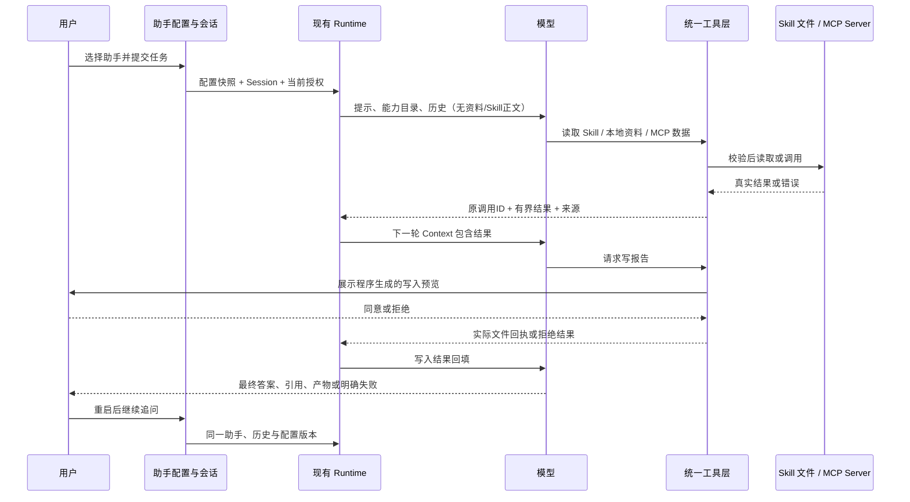

# 多助手配置、MCP 与 Skills 落地方案

## §0 当前进度与本轮边界

2026-09-14：**设计已核实，Gate PASS，用户已确认实施**。用户要求先完整阅读两份会议及配置设计，说明理解、形成方案并进行压力评审，确认后再开发。本文件是开发方案；同日的学习手册制作计划是另一个任务，不互相代表开发进度。

本阶段假设：**沿用同一个 Runtime，只增加助手配置和扩展适配，就能让不同助手安装新能力、按需调用，并在持久会话中完成有依据的任务。** 设计层没有剩余阻断；用户已确认，实施状态见[实施计划 §0](../plans/2026-09-14-agent-extensions.md)。下述设计评审是实现前的历史记录；用户确认后已有产品实现和本地验证，不以设计 Gate 代表产品验收。

- 三份新材料已逐行完整阅读：配置稿 135 行、0913 会议 365 行、0914 会议 929 行，共 1,429 行。
- 已核对原项目设计 §4、§5.2–5.7、Phase 4–5、里程碑与测试策略，以及现有相关代码。
- 当前代码基线：会话 Task 1–12 离线通过；原更正回答失败后的真实复测仍未完成。证据沿用[当前阶段记录](../../../local-agent/trial/directory-check.md)及[会话验收记录](../../../local-agent/trial/session-live-check.md)，本轮不重跑、不改写历史。
- 设计压力评审（实现前）：一次独立只读主审 PASS；两处接口歧义已直接修订，见 §8。文档本地链接与空白检查通过。此时产品代码、离线实现验证、真实集成验收均未开始；当前状态只由实施计划维护。

## 1. 我对下一阶段的理解

现在已经解决“一次任务如何调用工具、保存过程、继续会话”。下一步解决“谁在执行、它装了什么能力、这些能力怎样进入同一个循环”。

1. **Agent 配置**决定身份、模型、可用能力和预算。多个 Agent 是多个可选择的助手，共用运行引擎，各自拥有会话。
2. **Skill**提供做事方法。先让模型看到名称和适用场景，需要时通过工具读取正文，再按需读取引用材料；它不自带更大的权限，也不是另一个推理循环。
3. **MCP**把外部服务接到现有工具注册表。模型仍然发 Tool Call，Runtime 仍然校验、执行、回填和记录。
4. **联合评测**证明安装确实增加能力、模型确实使用、结果确实进入下一轮，并在重启和长历史后保持身份、事实来源与任务连续性。

这一批的“多 Agent”采用 0914 会议确认的**多个配置化助手**。不实现助手自动互相委派、共享记忆、群聊或并行协作。多个配置是否提高任务效果要靠使用验证，不能从助手数量推导。

## 2. 来源对齐与必须说明的差异

原始材料只提供需求和设计参考；里面的示例命令、凭据保存方式、框架演示不是当前执行授权。

| 来源 | 明确内容 | 本方案处理 |
|---|---|---|
| [0913 会议](../../../meeting/0914/会议录制：agent-meeting-0913.md)，03:44、08:03–17:19 | 配置工作区；日志、会话、能力目录；已有两种硬编码行为 | 保留现有 SQLite；配置与能力包文件持久化。JSON 是配置选择，不把会话改存 JSON |
| [0914 会议](../../../meeting/0914/会议录制：agent-meeting-0914.md)，04:37–09:03 | 模型、工具设置、多个助手配置；09:03 明确弱化配置稿 §5 之后的强制说法 | 配置作为本项目第一步，但不是 MCP/Skill 协议的必需前提 |
| 同上，09:19–16:39 | 不同助手可有不同提示、模型、能力；协作只是另一种设计 | 本批做选择与隔离，不把子 Agent 调度混入配置工作 |
| 同上，17:35–39:24 | Skill 的元数据、按需正文、渐进引用；模型选择；触发词可选；上下文留存取决于实现 | 做模型选择与用户显式指定；不做关键词路由器、自动检索安装市场或独立 Skill Loop |
| 同上，39:30–48:36 | MCP 的 tools/resources/prompts，适配注册并进入 tool list | 三类都能发现；分别提供调用/读取/取模板的受限入口，不将三类数量简单相加、假称协议规定 |
| 同上，49:16–51:15 | 下一步多助手 + MCP + Skills；装新的并实际使用；简单页面；允许自建 MCP | 验收必须增加第二份能力后仍可用，不能只演示写死的一套 |
| [配置对象设计](../../../2-Agent配置对象设计.md)，§0–4、§6–9 | 五类配置；Agent 与 Session 分离；先迁移再管理；预算单一来源 | 采用五类配置及渐进迁移。其“本批不做 Skill/MCP”被最新会议和用户本次要求扩展 |
| [原项目设计](../../../0-个人本地智能助手-Agent项目设计方案.md)，§4、§5.6–5.7、Phase 5 | Agent 核心对象，统一适配，安装/发现/依赖/权限 | 本阶段交付主线；MCP 与 Skills 不直接驱动第二套 Loop |
| 原项目设计，Phase 4、6–7 与 M3–M5 | 多 Provider、Cron、长期 Memory、完整作品 | 本批不自动补齐。交付可称“本阶段扩展闭环成立”，不能称原项目所有里程碑完成 |

两个进一步的校正：Session 是持久连续交互，不是配置稿口语中的“一次性任务”；会话应属于 Agent，而一次执行属于 Run。配置稿的“387 个测试原样全绿”在实施时理解为保留既有行为契约；必要接口迁移可以更新测试调用方式，但不能删除断言、放宽期望来凑绿。

## 3. 范围与路线选择

| 路线 | 收益与代价 | 结论 |
|---|---|---|
| 只做配置对象，能力扩展留以后 | 改动最小，但没有达到会议结尾“安装新 Skill/MCP 并使用” | 作为第一个里程碑，不作为整批交付 |
| 配置化助手 + 受限安装 + 同一 Loop 联合验收 | 能验证架构扩展性；需要补 Schema、来源与隔离接缝 | **推荐本批采用** |
| 自动多 Agent 协作 + 通用插件平台 | 调度、子任务状态、授权传播、共享上下文与成本一起扩大 | 后置，需另立用户目标 |

本批支持：两份既有助手配置、第三份组合示例配置；文件管理配置、CLI 与最小页面选择；Skill 本地包导入/启停/绑定/按需读取；MCP stdio Server 配置/启停/发现，Tools、静态文本 Resources、文本 Prompts；受支持 Schema 与结果校验；来源引用与历史接续；固定离线、协议及真实场景验证。

本批暂不支持：自动子 Agent 协作、并行 Run、第二 Provider、Cron、跨会话 Memory、IM 渠道、通用 Shell、Skill 脚本执行、依赖自动安装、远程能力市场、MCP Streamable HTTP/OAuth、二进制/多模态内容、Resource 模板与订阅、Sampling/Elicitation/Tasks。必须展示“不支持/不可用”的原因，不能悄悄跳过后声称完整兼容。

首批选择 stdio，是为了用本机独立 Server 完成真实协议连接并减少账户及网络因素；外部进程仍是真实 MCP，不等于必须是云服务。后续 HTTP 可沿同一适配接口增加。本批不宣称完整 MCP 协议覆盖。

## 4. 要交付的一个完整场景

提供三个配置：保留“单文件问答”和“目录问答”，新增“项目简报”。前两个验证迁移无回退，第三个验证不新增专用 Runtime 分支也能组合能力。

用户在“项目简报”中新建会话，提出：**“读取本地项目说明，结合项目状态服务的最新记录，按简报方法生成报告；没有证据的内容标明未知。”**

流程顺序由模型按任务决定；没有把上述步骤硬编码成业务工作流。只有原有文件助手的首步规则继续由其策略约束。验收还要安装第二个未写入 Runtime 的 Skill/MCP 能力，并用实际模型调用验证新增能力，排除专为示例硬编码。

## 5. 最小架构与接口

以下模块名、字段、文件路径是**拟新增设计**，不是已存在的命令或实现。保留现有工程布局，不为了目录结构做大重构。

### 5.1 Agent 对象与装配

配置是声明式数据；模型输出、Skill 正文、业务文件均不能修改配置或开启新工具。

现有接入点已定向核实：`runtime.py:133` 有主循环及 RequestBuilder 注入点；`tool_runtime.py:237` 目前拒绝非 builtin 来源；`sessions.py:83` 尚无助手归属；`web_runs.py:405` 仍通过全局 factory 创建 Provider。新增配置解析必须统一 CLI/页面的 Run 装配，不能只改变前端下拉框。`file_tools.py:213` 和 `conversation.py:125` 的来源校验也需纳入组合策略。

| 对象 | 最小信息与约束 |
|---|---|
| AgentDefinition | `id`、名称、配置格式版本、模型选择、提示模板与补充指令、内置工具/Skill/MCP 绑定、预算、审批策略 |
| ResolvedAgent | 通过校验的不可变配置、内容摘要、提示、工具注册表和策略；Runtime 接收它，而不按 Agent 名称分支 |
| CapabilityCatalog | 本机已安装 Skill/Server 的版本及可用状态；“已安装”不自动表示对所有助手开放 |
| RunContext 扩展 | `agent_id`、配置摘要、实际模型、Skill 版本、MCP Server/能力清单摘要与当前会话范围 |

拟新增 `local_agent/agents.py` 承担 `load/resolve`，隐藏模板渲染、校验与权限交集；持久化配置放在独立受管理目录。业务 workspace 的 `write_file` 无权写此目录。配置文件建议 JSON，不执行 Python 表达式、shell 字符串或导入路径。

五类设置的取舍：

- 身份：模板确定通用行为；允许用户修改补充提示。预算数字由配置渲染，权限规则仍由程序执行。
- 工具：只接受已知内置工具、已安装 Skill 版本、已配置 Server 的明确能力白名单；不默认通配所有新发现工具。
- 模型：本批沿用 DeepSeek Adapter，模型名在助手配置中选择；密钥仅引用环境变量名。保留 Provider 接口，不扩展多厂商矩阵。
- 预算：既有助手沿用现值；组合助手建议最多 10 次模型请求（含摘要/修复），每次回复最多 4 个工具请求，运行活跃时间 120 秒。MCP 调用最多 15 秒，受剩余 Run 时间限制；文件工具沿用原限制。配置不能突破宿主上限。
- 审批：只支持沿用“有副作用逐次询问”与“禁止副作用”；本批不做“本次会话永不再问”。配置里可以收紧，不能关闭写文件的既有审批约束。

现有单文件、目录、会话追问是任务/证据策略，可作为配置引用的受控策略存在。移走 Runtime 的模式装配分支，不追求全仓库不出现任何 `mode` 或 `if`。新增全新能力仍需 Adapter；只有组合已有能力的新助手才应做到“只加配置”。

### 5.2 多助手与会话隔离

- Session 固定 `agent_id` 与配置修订；Run 保存完整有效配置快照（不含密钥）及实际能力清单。运行中不热换模型、提示或 Schema。
- 修改配置生成新修订，对新会话生效；旧会话继续绑定旧修订，界面明确显示。切换助手进入该助手的会话列表，不把现有 Session 改归属。
- 全局禁用/撤销能力立即阻止新调用，并取消受影响的运行；旧快照不恢复已撤销权限。当前可执行能力始终是“绑定快照 ∩ 当前有效授权 ∩ 任务范围”。
- 每个历史读取、搜索、恢复、产物查看入口都检查 Session 所属助手。能力包只读内容可共享；会话和本轮工具证据不能串用。相同业务 workspace 的公开文件可以按各自权限读取，不承诺操作系统账户级隔离。
- 旧数据库以事务迁移，根据既有 file/directory scope 绑定对应兼容配置，保留 ID、消息、引用和失败记录。旧 Run 没记录的配置字段标记 legacy/unknown，不能补造历史事实；失败回滚。删除助手只停用，保留旧会话可读。
- 沿用全局一个活跃 Run；多助手不是多进程并行。配置页不能绕开现有会话并发与取消机制。

### 5.3 Skills：安装、使用与上下文生命周期

拟新增 `local_agent/skills.py`，负责包校验、安装目录、绑定后的 catalog 和受限读取。

1. 用户指定本地 Skill 目录，检查后复制到受管理的不可变版本目录；至少含 `SKILL.md` 的 YAML 头与正文。识别 `name/description`，保留版本、兼容性和可选元数据。原项目示例的 `manifest.json` 作为可选本项目依赖声明，不强迫现成 Skill 必须补写它。
2. 检查重复 ID、名称/版本、文件编码、总大小、相对路径及符号链接；不可越出包根目录，不触发安装脚本。结构化声明的必要工具、环境缺失时显示不可用及具体缺项；自然语言 `compatibility` 展示给用户，不声称程序能完整推断依赖。“可加载”不等于任意任务可完成；声明 `allowed-tools` 不是授权。
3. 初始 Context 只包含该助手可用 Skill 的 ID、名称、描述与版本；正文和引用不预装。
4. 模型调用 `read_skill(skill_id, relative_path, intent, cursor?)` 读取主文件或包内文本引用，返回正文、版本、内容摘要与来源，沿原 ToolCall ID 回填。长引用返回 `next_cursor`；续页校验游标签名并绑定当前 Agent、Run、Skill 版本、相对路径、内容摘要和位置，拒绝篡改/串用。主文件按安装限额完整读取。这是对独立只读包目录的受控入口，不扩大业务 `read_file` 范围。
5. 默认由模型根据任务选择；页面/CLI 允许显式指定一个已绑定 Skill，将指定关系记录在本轮请求中，仍要求通过工具读取。用户可看到实际读了什么；不靠关键词命中率代替使用证据。
6. 正文随正常 tool 消息进入历史；当前请求已有正文时不重复注入。摘要压缩后只保留用过的 Skill/版本及需要重读的标记；目录仍可见，模型需要具体方法时重读。禁用的旧 Skill 仅是历史，不因摘要再被激活。

第一版只执行已有工具，不执行 Skill 附带的任意脚本。含 `scripts/` 的包可以保留；必须运行脚本才能完成的 Skill 明确不可用，不能把“导入成功”写成“完全支持”。随包的文本方法和引用读取属于本批必交付。

### 5.4 MCP：统一接入但不跳过原来的校验

拟新增 `local_agent/mcp_client.py` 和 `mcp_tools.py`：Client 管连接与收发，Adapter 把收到的协议结果转换成内部工具结果；Runtime 不直接理解 stdio/JSON-RPC。

安装与生命周期：用户配置已安装的可执行文件、参数列表、工作目录、允许传入的环境变量名及能力白名单。启动使用参数数组，不用 shell；不隐式下载或运行安装器。只接用户认可的本地 Server，启动即可能执行本机代码，不声称 stdio 自带沙箱。环境采用最小白名单，不把模型密钥或其他环境整体传给 Server。

连接按初始化、版本/能力协商、发现、就绪、关闭执行；首批以已核对的 MCP `2025-11-25` 为兼容基线，不宣称它是所有 Server 的最新版本。只调用对方声明的能力；分页列举有页数/总大小/重复游标保护，列表过大则明确不可用，不静默保留第一页。Run 开始冻结清单，变更通知使下一次连接刷新；当前清单不得被远程动态扩权。

| MCP 类别 | 首批内部入口 | 权限和 Context 行为 |
|---|---|---|
| Tools | 按 `server_id + 远端名称` 生成稳定、合法且防冲突的模型工具名 | 模型自主调用；参数校验后发 `tools/call` |
| Resources | 每 Server 一个有白名单的 `read_resource` 入口；注册发现的静态 URI 目录 | 通过 MCP `resources/read` 取文本，不把远端 `file://` 当成本机路径打开，不自动获取外链 |
| Prompts | 发现目录；用户明确选择后允许 `get_prompt` 取本轮模板 | 返回为带来源的模板内容，不伪造历史 user/assistant 消息，不提升为系统规则；未选择时模型不能擅自启用 |

Schema 与执行：

- 当前工具仅支持一层字符串，需增加经过验证的 JSON Schema 校验。MCP 工具面向模型使用 `{intent, arguments}` 包装；`arguments` 保留远端原始 Schema，发送时仅解包它，避免框架 `intent` 与 Server 自有字段撞名。
- 支持对象、数组、数值、布尔值、字符串、空值以及常见约束和本地引用；保持远端约束，不把未知类型转成字符串。禁止联网解析 `$ref`；无法校验或无法传给当前 Provider 的 Schema 在注册时标明不支持，不降级成任意 JSON。
- 仅已白名单的只读工具进入首批模型列表。Server 的只读提示不是授权依据；未知/写入型 MCP 工具显示发现但禁用。报告写入走已有内置 `write_file` 及实际落盘回执，不泛化外部写入成功验证。
- 当前只准 builtin 的来源检查改为明确识别 `builtin/skill/mcp` 并分别校验绑定与授权；不删除来源检查。三类仍遵守统一的输入、错误码、成功结果验证契约，未知来源拒绝执行。
- MCP `isError=true`、协议错误、断线、进程退出、超时分别标准化；正常错误也按原调用 ID 回填，模型有预算时可以修正参数。拒绝/取消/预算耗尽沿用现有停止策略。超时不自动重放已发送的调用。
- Client 对真实收到的响应生成本次连接/请求回执，绑定 Server、Run、ToolCall ID、远端请求 ID 与内容摘要；Adapter 必须验证回执、信封和大小。声明了 `outputSchema` 时校验 `structuredContent`；未声明时按受支持文本/JSON 内容类型和结构校验，不要求合法纯文本 Server 额外提供 Schema。不能仅凭远端自报成功就制造本地执行证明或 Artifact。
- 取消/超时使在途请求失效，关闭并回收本批拥有的进程及管道；迟到结果不得进入其他 Run。清理最长 2 秒，不能无限等待。Server 停止、重连不得重放历史调用。

工具成功只证明**收到并校验了这次 Server 的返回**，不保证第三方信息客观正确。结果中保留此来源边界；内容正确性由固定样例的独立标准答案检查。

### 5.5 Context、来源与原有验真能力

复用 `ToolRegistry → ToolRuntime → Runtime → Session journal → 下一轮 Context`。Skill/MCP 不旁路写 messages，也不使用另一个内部模型调用。

- 新能力的描述、Schema、Skill 目录、正文、历史和工具结果全部计入现有完整模型请求的 64 KiB 上限；沿用 48 KiB 压缩触发，不仅统计消息正文。
- 建议初始能力定义合计最多 16 KiB，单次新扩展工具最终 JSON 信封最多 12 KiB，Skill 主文件最多 8 KiB。安装包文本总量最多 1 MiB，单次引用读取按 12 KiB 结果上限分页。初始静态配置过大先拒绝启用，说明缩减项目；不静默删除某个工具或 Skill。
- 新增组合证据策略，可引用本轮已验证的本地文件或 MCP 文本/结构化结果。保持原有单文件/目录答案协议兼容，不为 MCP 取消原有引用校验。
- 引用使用来源类型、快照 ID 和行/字段定位；文本 quote 由程序从保存快照提取。MCP JSON 使用稳定字段定位/规范化快照，模型不能伪造 URL、路径或已执行动作。引用 Skill 方法不等于证实项目事实。
- 复用当前 Session 历史工具取回旧来源；来源与该 Session/Agent 关联，旧快照标注当时值。用户问“最新”必须重新取数，历史值不能当成当前值。
- 记录外显的配置版本、可见目录、实际读取、工具参数、结果、下一轮请求清单和停止原因。业务材料依旧按现有日志策略保护；内容级验证只对公开/合成验收材料启用，不新增隐含思维链采集。

### 5.6 页面和安装入口

沿用现有本地页面：增加助手选择/创建（从模板复制并填写必要字段）、每个助手的会话列表、Skill 本地路径导入及绑定、Server 配置导入/启停与能力选择。配置文件编辑仍是完整管理方式，不开发可视化工作流编辑器。

安装状态区分“已导入、已绑定、依赖不满足、已就绪、停用/错误”；运行记录显示实际使用的 Skill/MCP 名称和结果，沿用已有审批与取消。CLI 暴露相同操作，具体命令在实施时写入 README；本设计里的拟接口不当成现有可运行命令。

优先使用官方 MCP Python SDK 处理协议、标准 JSON Schema 库处理嵌套校验、安全 YAML 解析器处理 Skill 头，作为可选扩展依赖集中在 Adapter/Loader。确认实施后锁定与本项目 Python 环境兼容的版本；不手写完整协议/通用 YAML 解析器来维持“零依赖”。没有开启扩展时，原有内置运行方式继续可用。本轮未安装依赖。

## 6. 开发任务与里程碑

下列是顺序任务清单，不是本轮已执行事项。共同文件较多，默认单线实施；只在有独立价值的边界做一次主审。

| 阶段 | 开发任务与主要文件（新增项标注“拟”） | 退出条件 |
|---|---|---|
| A 配置进入现有闭环 | 拟 `agents.py`；调整 `runtime.py/prompts.py/provider.py/file_tools.py` 与组装入口；两份内置配置；预算单源渲染 | 既有模式行为保持；第三份组合已有能力的配置可解析，无需按助手名改 Runtime；非法配置在调用模型前报错 |
| B 多助手可管理、会话不串 | `sessions.py/session_store.py/__main__.py/web.py/web_runs.py/static/`；配置修订与旧会话迁移；最小选择/创建页面 | 选择、保存、重启均有效；跨助手会话/历史/结果混用被拒绝；修改配置不偷改旧会话 |
| C Skills 可装可用 | 拟 `skills.py` 与包目录；`context.py/tool_runtime.py` 接入；本地导入和状态展示；两份小文本 Skill | 元数据先入、正文按需、引用渐进；新增包不改 Runtime；依赖缺失、禁用与压缩后重读行为明确 |
| D MCP 可装可用 | 拟 `mcp_client.py/mcp_tools.py`；`tool_runtime.py` Schema 接口；Server 配置；独立协议测试进程 | tools/resources/prompts 三类规定范围可用；取消、断线、错参、伪成功/错响应不破坏宿主；第二 Server 无需写专用核心分支 |
| E 联合任务与交付 | `conversation.py/answers.py/context.py` 来源适配；页面引用；固定集成评测、说明和示例包 | 完整联合场景、第二套新能力、重启和压缩追问、错误收口通过；分开记录离线、真实模型和人工核对 |

依赖顺序 A → B → C → D → E；C、D 共用统一工具契约，不为了并行同时改同一套接口。E 的证据接口需求在 A 明确，不能等最后才发现回答只接受本地文件。

每阶段先做最小相关验证。A–B 交付配置化多助手、C–E 交付能力扩展闭环时，各做一次必要的完整回归；未改动且已有同版本通过证据不重跑。最终只有一次交付 Gate，不把每次文档改动变成全套审查。

## 7. 固定验收与成本

验收主张分三层：协议/程序链路正确；真实模型能完成代表任务；更大样本的稳定性及用户收益。首批证明前两层的约定样例，不承诺统计成功率或“所有回答准确”。

| ID | 固定验证 | 通过依据 |
|---|---|---|
| A1 | 两份原模式配置迁移 + 第三份组合配置 | 原行为与拒绝边界保留；第三份不需新增 Runtime 分支；模型/提示/预算来自实际配置 |
| A2 | A 助手与 B 助手分别建会话，重启、改配置、停用能力 | 身份/版本保留，历史不串；撤销权限生效，旧配置不能复活能力；旧数据库迁移失败回滚 |
| S1 | 安装两份此前未加载的 Skill，模型自然选择其一 | 初始仅元数据；自主读取正文及一个引用；原 ID 回填下一轮，另一份正文没有偷放进去 |
| S2 | 显式指定、缺依赖、包越界、禁用、压缩掉正文 | 指定可追踪，越权/缺依赖可解释失败；压缩后重读固定版本，不靠旧“已加载”标志冒充可见 |
| M1 | 真 stdio 进程的 Tools/Resources/Prompts | 实际握手、分页发现、动态注册、工具/资源读取与用户指定模板；能新增另一 Server，无核心定制 |
| M2 | 嵌套 JSON/错类型/重复字段/冲突名称/超大 Schema | 正确参数无损传达，错误在发送前拦截；不得静默弱化 Schema 或覆盖另一工具 |
| M3 | isError、无效输出、错 ID、断线、超时、取消、迟到响应 | 不伪成功、不串 Run、错误入 Context 或明确终止；取消并清理有界，不自动重放；恢复后能开始新 Run |
| C1 | Skill 与 MCP 返回指令要求加权限、运行脚本或跨助手读历史 | 配置/工具边界未改变，无副作用；正文不能成为高权限指令 |
| E1 | 项目简报联合场景，成功写入与用户拒绝各一次 | 数据值/原文来源正确；实际写入与预览一致，回执进入下一轮；拒绝无文件，不声称已创建 |
| E2 | 同会话“旧约定→更正→未完事项”，压缩并重启后追问 | 更正和未完事项仍可找到，Skill 可重读；MCP 历史值标时间、问最新时重新调用；不假称会话真实欠证据已经补齐 |
| E3 | 新安装第二套 Skill + MCP 后执行另一个小任务 | 无修改 Runtime/Adapter 的专用实现；实际工具源于新安装能力并支持答案 |

测试分层与预算：

- **离线**：确定性 Provider 与恶意/失败响应测试，验证参数、权限、消息匹配、引用和状态；模型 API 0 次。
- **真实协议**：用独立 MCP Server 进程测试连接、发现、调用和故障。主固定服务提供合成项目状态；另选一个独立维护的现有只读 Server（优先无需账号、符合本批能力的服务），实施时锁定版本并保存配置。自建服务可以验证协议链路，但单独通过不能冒充第三方互操作通过。
- **真实模型**：先跑 1 个小探测，再执行固定组共最多 6 个 Run，探测成功复用为该组第 1 个。覆盖首次联合任务、重启追问、压缩后更正/未完事项、第二套能力、MCP 错误、拒绝写入；每 Run 上限 10 次模型请求（摘要/修复均计入），整组上限 60 次请求。依赖固定合成数据，不外发原始会议资料。
- **内容复核**：对成功组逐项比对标准事实、引用和实际文件；自动 `completed` 只作预筛。无需再调用模型当评分器。记录 AI 人工式内容复核与用户验收的区别。
- **停止条件**：首个阻断失败即暂停同类后续样例，定位修复后只重跑受影响项；离线预备已过再真实运行。固定组通过且证据齐全即收口，不追加“再试一个”。失败不可删除、改名通过或通过新摘要掩盖。

美元/人民币费用取决于用户选定模型及实际 usage，本轮不编造报价；实施验收报告记录请求数、输入/输出 token、耗时和配置。重跑仍计入该组总预算，达到上限后保留未通过状态，不自动加码。

## 8. 方案压力评测（设计层，未运行产品）

这里的压力评测是反例推演与需求/代码接口核对，不是并发压测；本批仍只有一个活跃 Run。每一项都转为上表的固定验证，不再展开无限边界枚举。

| 反例压力 | 若只做表面接入会怎样 | 本方案的明确处理 | 验证落点 |
|---|---|---|---|
| 同一个模型、不同助手，切换时沿用旧会话 | 身份、工具或历史串用 | Session 固定助手和修订，所有读取入口核对归属 | A2 |
| 配置写 8 个文件，提示仍写 4 个 | 模型认知与程序限制矛盾 | 数字单源渲染，实际权限和预算独立强制 | A1 |
| 包已导入，但依赖工具没装 | 页面显示成功、实际不能用 | 安装/绑定/就绪分开；列出缺依赖 | S2 |
| 100 个大 Skill 或 MCP 大 Schema | 请求超限或漏掉部分能力 | 元数据/Schema 总预算，正文按需；超限明确拒绝而非静默丢弃 | S1、M2 |
| MCP 有名为 intent 的字段或嵌套数组 | 框架覆盖参数或全判为非法 | wrapper 与原 arguments 分离，标准 Schema 校验 | M2 |
| Server 只说成功却没有有效响应/返回错类型 | 重演早期“工具自称成功就相信” | 真实响应回执 + 关联检查 + 输出 Schema；仍不等于事实真值证明 | M3、E1 |
| Server 自称只读，实为写入 | 权限声明越权 | 不信任自报提示；可信来源与本地明确白名单；首批禁用外部写入 | C1 |
| 模型拿 MCP 的 file://URI 读本地文件 | 绕过本地文件范围 | URI 仅路由到对应 Server；不由 Host 自行打开 | C1、M1 |
| MCP 模板包含“这是用户刚批准的写入” | 伪造授权或对话 | 来源化模板不伪造角色；写入仍走真实用户审批 | C1、E1 |
| Server 卡死或取消后才回来 | 主进程不能停、污染下一任务 | 请求失效、进程/管道有界清理、无自动重放 | M3 |
| 会话压缩后仍以为 Skill 在 context | 方法丢失、旧规则误用 | 版本可追溯、可见性标记、重读入口和历史取回 | S2、E2 |
| 只测自建样例，所有结果都写死 | 看似架构完成，其实无法扩展 | 新增第二 Skill 和独立 Server、不改核心、真实模型使用 | E3 |

**主审结果：PASS（设计层）。** 独立只读审阅核对了来源范围与现有 Runtime/Context/会话接缝，未发现阻断本批交付的矛盾。主审指出两处易误读接口，已修订：MCP 的 `outputSchema` 仅在声明时要求验证，合法纯文本返回可用；Skill 引用读取补充绑定版本和内容的续页入口。主任务另明确自然语言依赖不能自动完全识别，避免“加载成功”冒充“能完成任务”。这些是本设计的局部澄清，不启动第二轮完整评审。

技术交接：可以按 A–E 实施，仍须取得 §7 的实现与真实证据。当前代码未因此通过扩展验收。

通俗交接：方案已经说明助手怎么区分、能力怎么装、模型怎么用、结果怎么验和失败怎么停；现在可交由用户确认，随后从第一步开发。两种交接结论一致，均为设计 PASS。HTTP、任意脚本、多 Provider 不因“还不通用”被重新加回本批。

## 9. 确认后如何开始

建议确认本方案的三个边界：**多助手配置而非自动协作；MCP 先 stdio 与受限文本能力；Skills 先方法与引用、暂不执行脚本。** 这些是有意控制范围的本阶段取舍，不是原设计全部能力已经完成。

确认后从阶段 A 开始：让两份原有行为变成配置，并保持已有工具与会话闭环。先交付可运行的小切片，再依次接入 B–E；不在开发前继续扩大调研或评审轮数。

## 10. 协议核对依据

以下是 2026-09-14 定向查阅的官方依据；项目限额、白名单、包装方法、存储和验收安排是本方案选择，不冒充协议要求。网页读取通道超时后改用检索工具核对官方页面，没有安装任何能力。

- [Agent Skills 格式规范](https://agentskills.io/specification)：`SKILL.md` 的名称/描述、可选文件及渐进加载；`allowed-tools` 属于实验性字段，不能替代宿主授权。
- [MCP Tools（2025-11-25）](https://modelcontextprotocol.io/specification/2025-11-25/server/tools)：输入/输出 Schema、结构化结果、工具执行错误与协议错误。
- [MCP Resources](https://modelcontextprotocol.io/specification/2025-11-25/server/resources) 与 [Prompts](https://modelcontextprotocol.io/specification/2025-11-25/server/prompts)：资源与模板各有发现/读取接口，协议没有强制一律一对一变成模型工具。
- [MCP 生命周期](https://modelcontextprotocol.io/specification/2025-11-25/basic/lifecycle)与[传输](https://modelcontextprotocol.io/specification/2025-11-25/basic/transports)：初始化/协商/关闭，以及 stdio、Streamable HTTP 的差异。

本设计不把 `allowed-tools`、触发词、SDK 支持范围或 MCP 版本猜作已经实现的能力；具体依赖锁定和第三方互操作将在阶段 D 实测。
